Trademarks This project may contain trademarks or logos for projects, products, or services. Authorized use of Microsoft trademarks or logos is subject to and must follow <a href="https://www.microsoft.com/en-us/legal/intellectualproperty/trademarks/usage/general">Microsoft’s Trademark & Brand Guidelines</a>. Use of Microsoft trademarks or logos in modified versions of this project must not cause confusion or imply Microsoft sponsorship. Any use of third-party trademarks or logos are subject to those third-party’s policies.

<!-- vscode-markdown-toc -->
* 1. [Contoso Overview](#ContosoOverview)
* 2. [Omniverse Kit App Streaming Infrastructure Setup](#OmniverseKitAppStreamingInfrastructureSetup)
	* 2.1. [Architecture and Technology Stack](#ArchitectureandTechnologyStack)
	* 2.2. [Workflow](#Workflow)
	* 2.3. [Requirements](#Requirements)
	* 2.4. [Prerequisites](#Prerequisites)
	* 2.5. [Technical Skills required](#TechnicalSkillsrequired)
	* 2.6. [Azure Resource Deployment](#AzureResourceDeployment)
		* 2.6.1. [*Azure Resources Diagram*](#AzureResourcesDiagram)
		* 2.6.2. [*Create Resource Group*](#CreateResourceGroup)
		* 2.6.3. [*Create Virtual Network*](#CreateVirtualNetwork)
		* 2.6.4. [*Add Subnets to the Virtual Network*](#AddSubnetstotheVirtualNetwork)
		* 2.6.5. [*Create Network Security Groups*](#CreateNetworkSecurityGroups)
		* 2.6.6. [*Assign to subnets 'subnet-aks' and 'subnet-apim'*](#Assigntosubnetssubnet-aksandsubnet-apim)
	* 2.7. [DNS and Certificate Configuration](#DNSandCertificateConfiguration)
		* 2.7.1. [*Create self-signed certificates for private DNS zone*](#Createself-signedcertificatesforprivateDNSzone)
		* 2.7.2. [*Create LetsEncrypt certificates manually for public DNS zone*](#CreateLetsEncryptcertificatesmanuallyforpublicDNSzone)
		* 2.7.3. [*Create a .pfx from the full chain certificate and private key*](#Createa.pfxfromthefullchaincertificateandprivatekey)
	* 2.8. [AKS Cluster Configuration](#AKSClusterConfiguration)
		* 2.8.1. [*Create AKS Cluster*](#CreateAKSCluster)
		* 2.8.2. [*Create Nodepools*](#CreateNodepools)
		* 2.8.3. [*Configure Networking*](#ConfigureNetworking)
		* 2.8.4. [*Confirm and create cluster*](#Confirmandcreatecluster)
		* 2.8.5. [*RBAC Setup*](#RBACSetup)
		* 2.8.6. [*Pull kubeconfig locally and check access*](#Pullkubeconfiglocallyandcheckaccess)
	* 2.9. [API Management Service](#APIManagementService)
		* 2.9.1. [*Create APIM Service*](#CreateAPIMService)
		* 2.9.2. [*Configure Custom Domain and Private DNS Zone*](#ConfigureCustomDomainandPrivateDNSZone)
	* 2.10. [Application Gateway Service with Web Application Firewall](#ApplicationGatewayServicewithWebApplicationFirewall)
* 3. [Omniverse Kit App Streaming Deployment and Configuration](#OmniverseKitAppStreamingDeploymentandConfiguration)
	* 3.1. [(Optional) Move External Dependencies to your own artifact storage](#OptionalMoveExternalDependenciestoyourownartifactstorage)
	* 3.2. [Download Sample and Resources Files](#DownloadSampleandResourcesFiles)
	* 3.3. [Create Kubernetes Namespace](#CreateKubernetesNamespace)
	* 3.4. [Create Image Registry Pull Secret](#CreateImageRegistryPullSecret)
	* 3.5. [Install NVIDIA GPU Operator on AKS](#InstallNVIDIAGPUOperatoronAKS)
	* 3.6. [Install Memcached on AKS](#InstallMemcachedonAKS)
	* 3.7. [Install Flux on AKS](#InstallFluxonAKS)
	* 3.8. [Install Omniverse Resource Management Control Plane (RMCP) on AKS](#InstallOmniverseResourceManagementControlPlaneRMCPonAKS)
	* 3.9. [Create and deploy a custom Omniverse Kit Application](#CreateanddeployacustomOmniverseKitApplication)
		* 3.9.1. [Upload ISV custom kit app to a Container Registry](#UploadISVcustomkitapptoaContainerRegistry)
		* 3.9.2. [*Configure ISV Custom Kit App for Deployment*](#ConfigureISVCustomKitAppforDeployment)
	* 3.10. [Upload ISV custom kit app to a Container Registry](#UploadISVcustomkitapptoaContainerRegistry-1)
		* 3.10.1. [*Create Azure Container Registry using the Azure Portal*](#CreateAzureContainerRegistryusingtheAzurePortal)
	* 3.11. [Upload Helm Charts etc from NGC recommendation](#UploadHelmChartsetcfromNGCrecommendation)
	* 3.12. [Helm Chart Deployment and Configuration](#HelmChartDeploymentandConfiguration)
		* 3.12.1. [*Set environment-specific values*](#Setenvironment-specificvalues)
		* 3.12.2. [*Internal ingress controller helm nginx ingress controller*](#Internalingresscontrollerhelmnginxingresscontroller)
		* 3.12.3. [*FluxCD helm flux2*](#FluxCDhelmflux2)
		* 3.12.4. [*GPU Operator helm gpu operator*](#GPUOperatorhelmgpuoperator)
		* 3.12.5. [*Memcached helm memcached*](#Memcachedhelmmemcached)
		* 3.12.6. [*ExternalDNS scripts external dns*](#ExternalDNSscriptsexternaldns)
		* 3.12.7. [*Create required secrets*](#Createrequiredsecrets)
	* 3.13. [Omniverse Kit App Streaming Services](#OmniverseKitAppStreamingServices)
		* 3.13.1. [*Streaming helm kit appstreaming manager*](#Streaminghelmkitappstreamingmanager)
		* 3.13.2. [*Applications helm kit appstreaming applications*](#Applicationshelmkitappstreamingapplications)
		* 3.13.3. [*RMCP helm kit appstreaming rmcp*](#RMCPhelmkitappstreamingrmcp)
		* 3.13.4. [ *Deploy the custom streaming resources manifests omniverse azure*](#Deploythecustomstreamingresourcesmanifestsomniverseazure)
		* 3.13.5. [*Deploy HelmRepository manifests helm repostiories*](#DeployHelmRepositorymanifestshelmrepostiories)
		* 3.13.6. [*Create private DNS record for ingress controller*](#CreateprivateDNSrecordforingresscontroller)
		* 3.13.7. [*Create public DNS entry for App Gateway*](#CreatepublicDNSentryforAppGateway)
	* 3.14. [Validate Omniverse Kit App Streaming End Points via Swagger UI](#ValidateOmniverseKitAppStreamingEndPointsviaSwaggerUI)
* 4. [ ISV Web App deployment](#ISVWebAppdeployment)
	* 4.1. [Deploying Web Client Application in Azure](#DeployingWebClientApplicationinAzure)
	* 4.2. [ Power BI React Component Configuration](#PowerBIReactComponentConfiguration)
		* 4.2.1. [*Azure Apps Registration*](#AzureAppsRegistration)
		* 4.2.2. [*Power BI Workspace Settings*](#PowerBIWorkspaceSettings)
		* 4.2.3. [*Power BI Data Connections*](#PowerBIDataConnections)
		* 4.2.4. [*Event Hubs*](#EventHubs)
	* 4.3. [Event Hub React Component Configuration](#EventHubReactComponentConfiguration)
	* 4.4. [3D Viewport React Component Configuration](#DViewportReactComponentConfiguration)
	* 4.5. [Azure Static Web Application Deployment](#AzureStaticWebApplicationDeployment)
		* 4.5.1. [ *Deploying a React App to Azure Static Web Apps using Azure Portal*](#DeployingaReactApptoAzureStaticWebAppsusingAzurePortal)
* 5. [Final End-to-End Validation](#FinalEnd-to-EndValidation)
	* 5.1. [3D Viewer Component](#3DViewerComponent)
	* 5.2. [Power BI Component](#PowerBIComponent)
	* 5.3. [Validation of Complete ISV Web App Deployment](#ValidationofCompleteISVWebAppDeployment)

<!-- vscode-markdown-toc-config
	numbering=true
	autoSave=true
	/vscode-markdown-toc-config -->
<!-- /vscode-markdown-toc -->

##  1. <a name='ContosoOverview'></a>Contoso Overview

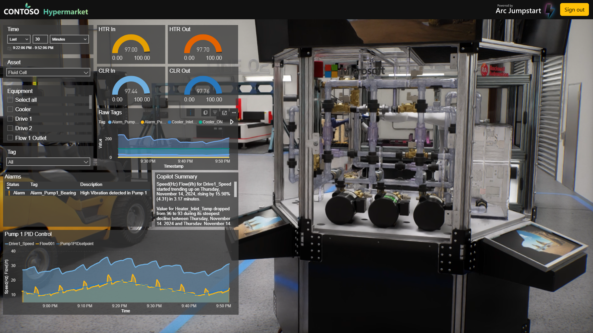

Hook \= Business Value Impact – motivate Developers (let’s capture the value broad enough incl IoT but captures production data)

* Industries are concentrating their SMEs to central locations, where they are being asked more than ever to give expert guidance to sites around the world. The combination of real-time machine data, in context and overlaid on 3D visualizations, means can gain situational awareness and react faster than ever.  
* Industries are migrating toward a 3D centric workflow  
  * Attrition of experts  
  * Data vs information   
  * ...  
* 3D centric workflows allow industries to quickly navigate to areas of interest, discovery issues, concerns, etc., and perform analysis, mitigation  
* Microsoft IoT brings together bronze, silver, and gold data together into a unified data lake  
* Omniverse Visualization brings the data to life by providing photorealistic and physics accurate representation of the data 

Today, developers are building solutions to provide Remote Operations Centers to a variety of industries from factory monitoring/automation to monitoring of physical assets.  These developers need mechanisms to quickly unify data from various ingress sources into a single unified environment.  From the unified data environment, the developers need to build out applications that display the data in a 3D centric physical representation while maintaining access to the rich underlying data.  This enables their users to gain situational awareness for analytics, decision making, maintenance, operations tracking, etc.  

Microsoft Fabric platform brings together raw (bronze data), silver (post-processed data) and gold data (interpreted data) into a single data platform for ingress and dissemination.  Nvidia Omniverse leverages industry standard OpenUSD to bridge the physical representation of the data with the data platform.

Better Together \= Technical Strengths

Fabric \+ Omniverse diagram of omniverse with authoring and reality capture feeding in, while fabric is the data foundation 

Microsoft – AIO – Fabric – 1D 2D Data – Contextualization – Analytics – Dashboarding 

NVIDIA \- Omniverse – Simulation – Physically Accurate Rendering – Interactive – USD Standards based \- 

##  2. <a name='OmniverseKitAppStreamingInfrastructureSetup'></a>Omniverse Kit App Streaming Infrastructure Setup

###  2.1. <a name='ArchitectureandTechnologyStack'></a>Architecture and Technology Stack


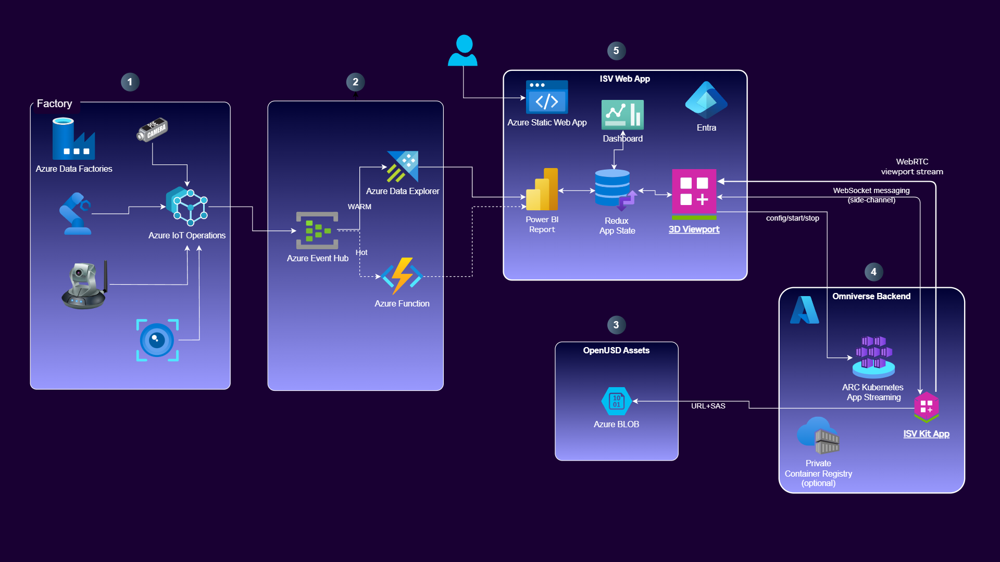

The Azure IoT Operations – Power BI – Omniverse (AIO-PBI-OV) architecture encompasses (from left to right) collecting IoT data from factory floor, efficiently processing and logging it, then updating a Power BI report that is synced with an Omniverse Streaming 3D Viewport to visualize the results in a very high-quality visual interactive digital twin.

The left side of this architectural diagram feeds IoT data via Azure IoT Operations into Event Hubs and Azure Data Explorer (ADX) time-series into a Power BI Report, which then updates the Redux global state with status information that is sent to the 3D Viewport updating the viewport visuals which information such as current operational status.

Legend for Architecture Diagram:
  1. Azure IoT Edge Telemetry Orchestration (plant floor, smart buildings)
  2. Telemetry Data Stream Contextualization via Azure Data Explorer
  3. USD Assets retrieved from Azure BLOB Storage
  4. Omniverse Scene Rendering and App Streaming
  5. Interactive digital twin composed of embedded 3D Viewport with Power BI Report in a single dashboard.

The 3D Viewport is composed of two parts: an interactive Omniverse streaming client that displays a remotely cloud rendered Omniverse 3D scene via low-latency Omniverse Kit App Streaming.   The Omniverse cloud rendering is implemented using Azure Kubernetes Service (AKS) and Omniverse Kit App Streaming that orchestrates a scalable NVIDIA RTX GPU accelerated compute and network infrastructure for an Omniverse Kit App.  Both the front-end 3D Viewport client and the backend Omniverse Kit App are expected to be customized by the ISV for their use cases.   More information about doing this customization may be found in the associated GitHub Repo.

This ARC Jumpstart guide provides the essential information needed by an ISV to implement this architecture in their own Azure Commercial Tenant cloud environment.

###  2.2. <a name='Workflow'></a>Workflow

This Activity Diagram presents a visual overview of the recommended workflow as described in the sections below.

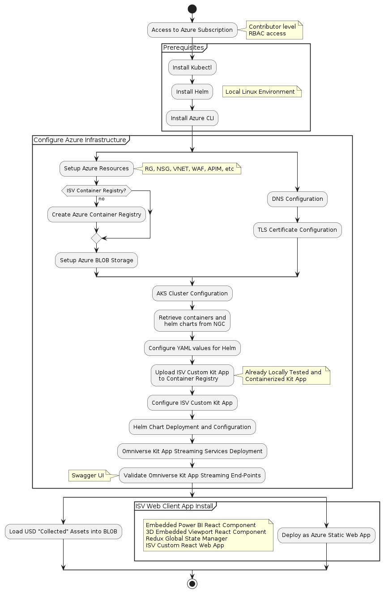

###  2.3. <a name='Requirements'></a>Requirements

Please review technical requirements of the [NVIDIA Omniverse Application Streaming API](https://docs.omniverse.nvidia.com/ovas/latest/deployments/infra/requirements.html#requirements)

###  2.4. <a name='Prerequisites'></a>Prerequisites

Prerequisites required to complete this setup include

* Access to Azure Subscription with Contributor level RBAC access

* Linux Operating system with Bash Shell

  * Install `openssl` using method appropriate for your Linux distro

* Install [Kubectl](https://kubernetes.io/docs/tasks/tools/#kubectl) on your deployment system (Version `1.29` or according to [API compatibility](https://kubernetes.io/releases/version-skew-policy/#kubectl))

* Install [kubelogin](https://azure.github.io/kubelogin/install.html) on your deployment system

* Install [Helm](https://helm.sh/docs/intro/install/) on your deployment system (Version`>3.14.0` or according to API compatibility)

* Install the [Azure CLI](https://learn.microsoft.com/en-us/cli/azure/install-azure-cli) on your deployment system

* Creation of an Omniverse Kit application container per [APPLICATION_DEVELOPMENT.md](APPLICATION_DEVELOPMENT.md)

* Creation of a web app per [APPLICATION_DEVELOPMENT.md](APPLICATION_DEVELOPMENT.md)

###  2.5. <a name='TechnicalSkillsrequired'></a>Technical Skills required

* Azure: This JumpStart expects familiarity with the Azure Portal, Azure technology stack including Azure Kubernetes Service,
Networking and Storage.

* Kubernetes: Entry level understanding of Kubernetes, the Kubernetes CLI and debugging are recommended.

* Helm Charts: Entry level knowledge of installation of Helm Charts is recommended.


###  2.6. <a name='AzureResourceDeployment'></a>Azure Resource Deployment

To access your subscription login to [http://portal.azure.com](http://portal.azure.com) and make sure you are in the correct subscription.

From here, the setup steps assume the following:

* All resources are created within a single resource group.

* All resources are created in the (US) East US region; however, you can use any region which supports NVIDIA A10 GPUs.

* All resource names are for example purposes only and are chosen for consistency purposes in documentation, you may choose your own resource names. 

* The selected vnet range and subnet ranges do not overlap (or are taken into consideration) with any planned peered vnets.

* The private DNS zone for our deployment is contoso-ov-kitappstreaming.net

* The public DNS zone for our deployment is iai-contoso.com and we will create a record for the subdomain kitstreaming in subsequent steps.

####  2.6.1. <a name='AzureResourcesDiagram'></a>*Azure Resources Diagram*

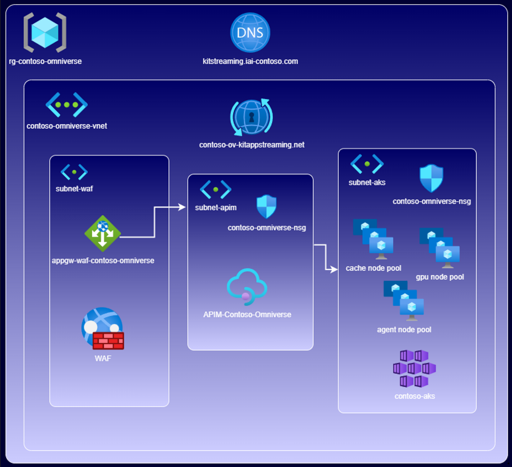

####  2.6.2. <a name='CreateResourceGroup'></a>*Create Resource Group* 

- Using the search tool at the top of the portal home page, search for `Resource Groups`
- Select the “Resource Groups” option to navigate to the Resource Groups page
- Click on “+ Create” to create a new resource group.
- Enter the information on the “Create Resource Group” dialog as shown in the picture below
- Select the correct subscription from the “Subscription” list.
- Provide a name for the resource group and select the region, e.g. `US South Central US`, or wherever you want this resource group to be created.  
- Click “Review+Create” button, do a final review of the supplied information in the next screen and click “Create”.

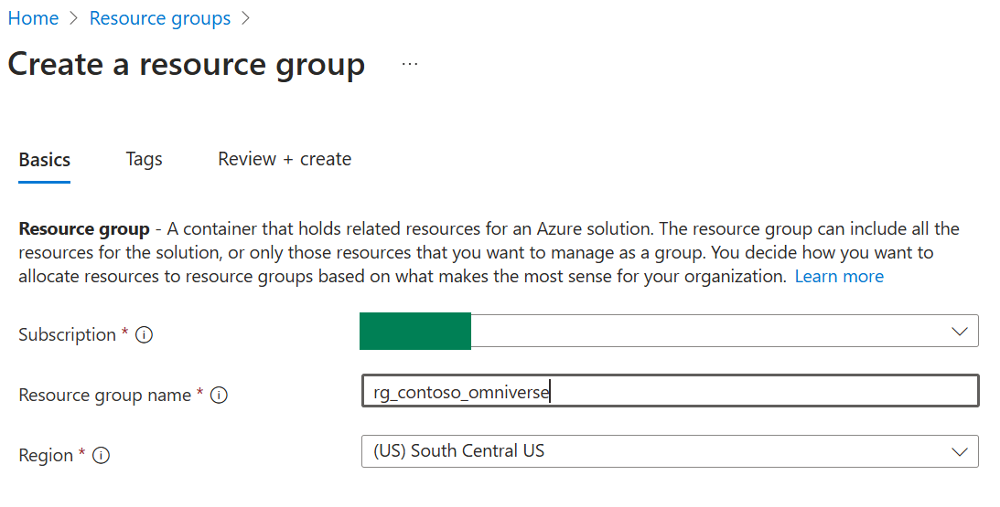

####  2.6.3. <a name='CreateVirtualNetwork'></a>*Create Virtual Network* 

- Using the search tool at the top of the portal home page, search for “Virtual Networks”
- Select the “Virtual Networks” option from the search results to navigate to “Virtual Networks” page. 
- Click on “+ Create” to create a new virtual network.  
- Enter the information on the “Create virtual network” dialog as shown in the picture below. 
- Select the correct subscription from the “Subscription” list.  
- Select the same resource group that was created earlier. 
- Provide a name for the virtual network, and then select the region created in 'Create Resource Group' section.
- Hit `Next` to continue to the Security tab (no configuration needed?)
- Hit `Next` to continue to the `IP Addresses` tab to configure Subnets
- Delete the `default` address space (e.g. 10.0.0.0/16)
- Create a new address space `10.2.0.0/16`, or if that address space already in use enter another available address space (e.g. `10.123.0.0/16`) and use it consistently throughout.

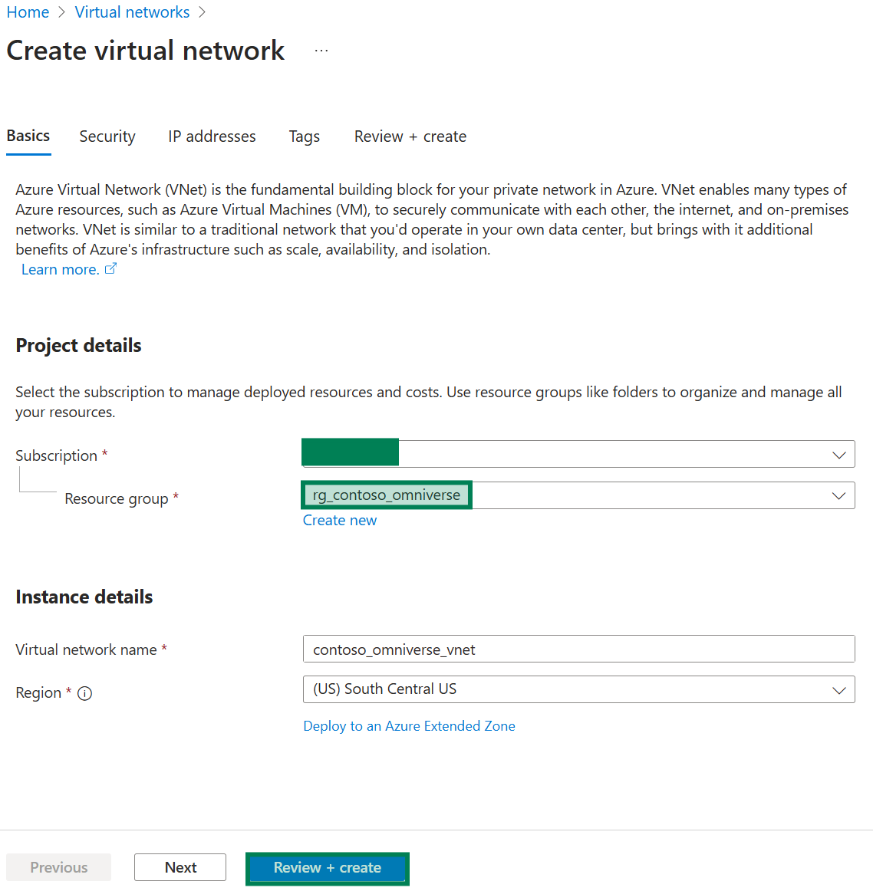


####  2.6.4. <a name='AddSubnetstotheVirtualNetwork'></a>*Add Subnets to the Virtual Network*

In this section we will add three subnets to the `10.2.0.0/16` Virtual Network created.  
Name of the subnet and IP address space for each subnet are shown below.

* `subnet-aks` - `10.2.0.0/24` 

* `subnet-waf` - `10.2.1.0/24` 

* `subnet-apim` - `10.2.2.0/24`  

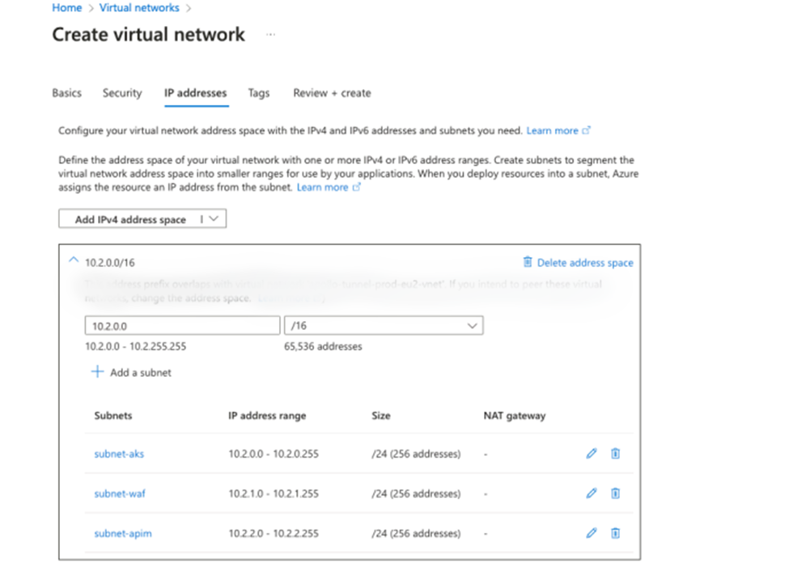

##### Create subnet for AKS

Click “+ Add Subnet” button to navigate to “Add Subnet” dialog. 
Enter all the required information as shown in the screenshot below for `subnet-aks` and click “Add” to create the subnet.

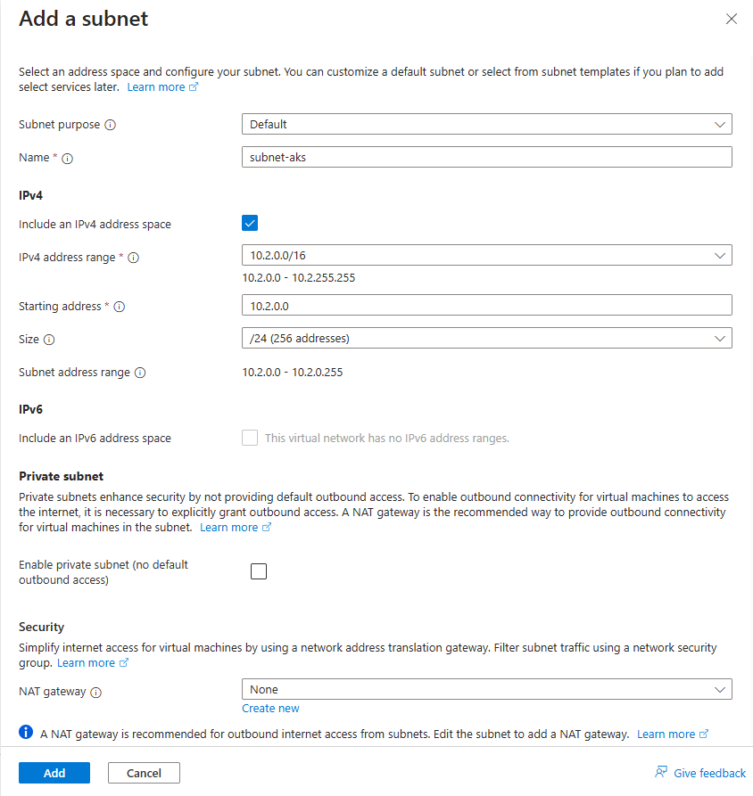

##### Create subnet for Web Application Firewall (WAF)

Click “+ Add Subnet” button to navigate to “Add Subnet” dialog. 
Enter all the required information as shown in the screenshot below for `subnet-waf` and click “Add” to create the subnet.

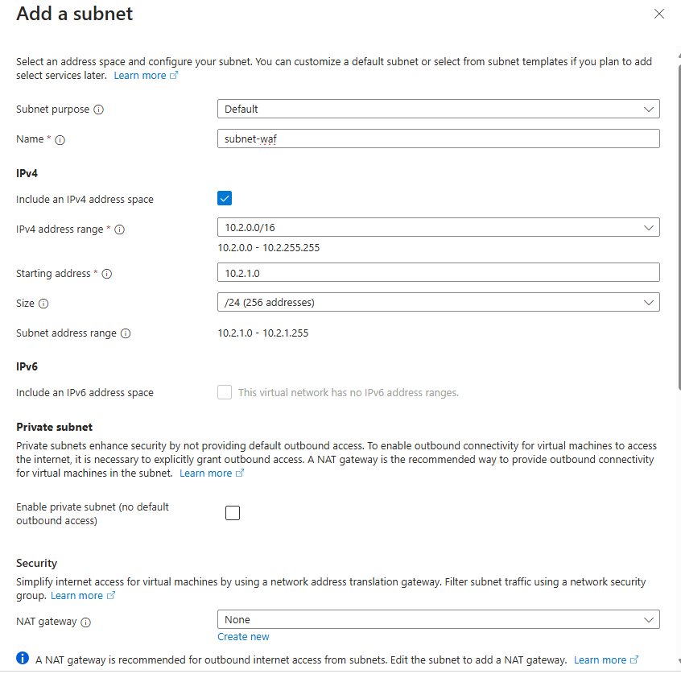

##### Create subnet for API Management (APIM) Gateway

Click “+ Add Subnet” button to navigate to “Add Subnet” dialog. 
Enter all the required information as shown in the screenshot below for `subnet-apim` and click “Add” to create the subnet.

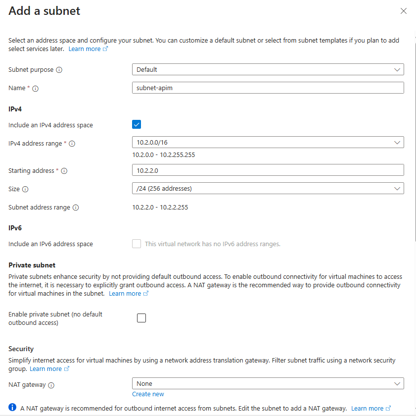

Finally, when all the subnets are created, click on “Review+Create” button on the “Create Virtual Network” dialog,
perform a final review of the supplied information for the three new subnets, and click on “Create” to create the virtual network.


####  2.6.5. <a name='CreateNetworkSecurityGroups'></a>*Create Network Security Groups*

- Using the search tool at the top of the portal home page, search for “Network Security Groups”, 
- Select the “Network Security Groups” option from the search results to navigate to “Network Security Groups” page. 
- Click on “+ Create” to create a new network security group.  
- Enter information on the “Create network security group” dialog as shown in the picture below. 
- Select the correct subscription from the “Subscription” list.  
- Select the same resource group that was created earlier. 
- Provide a name for the network security group and then select the region where you want this network security group to be created in e.g. South Central US 
- Review and Create the network security group.
- Click on the newly created network security group.


Create the following inbound rules as shown in the screenshots below.

* Add new rules 

  * Port 80 (http) 

    * Source: IP Addresses

    * Source: ideally your specific VPN CIDR blocks, also 10.0.0.0/8 

    * Source Port Ranges: * 

    * Destination: Any 

    * Service: HTTP 

    * Protocol: TCP 

  * Port 443 (https) 

    * Source: IP Addresses 

      * Source: ideally your specific VPN CIDR blocks, also 10.0.0.0/8 

      * Source Port Ranges: * 

      * Destination: Any 

      * Service: HTTPS 

      * Protocol: TCP 

  * Port 3443 (APIM management) 

    * Source: Service Tag 

    * Source service tag: ApiManagement

    * Source port ranges: * 

    * Destination: Service Tag 

    * Destination service tag: VirtualNetwork 

    * Service: Custom 

    * Protocol: Any

    * Destination port: 3443 

  * Ports 31000-31002 (streaming) TCP

    * Source: IP Addresses 

    * Source: ideally your specific VPN CIDR blocks, also 10.0.0.0/8 

    * Source Port Ranges: * 

    * Destination: Any 

    * Service: Custom 

    * Destination Port Ranges: 31000-31002  

    * Protocol: TCP

  * Ports 31000-31002 (streaming) UDP

    * Source: IP Addresses 

    * Source: ideally your specific VPN CIDR blocks, also 10.0.0.0/8 

    * Source Port Ranges: * 

    * Destination: Any 

    * Service: Custom 

    * Destination Port Ranges: 31000-31002  

    * Protocol: UDP

    * Name: *append* `UDP` *to name to resolve conflict*
     
##### Image Snapshots for Network Security Group

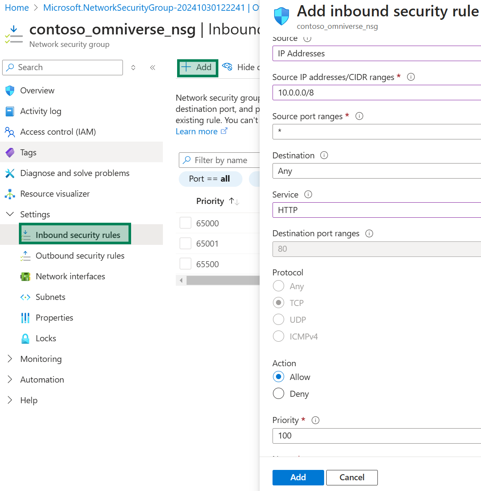

  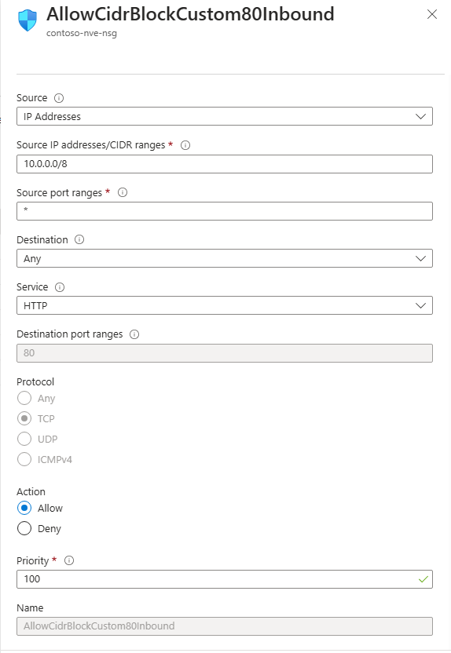
  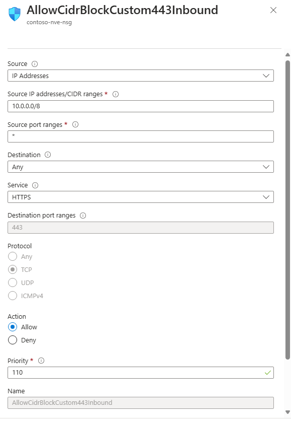

  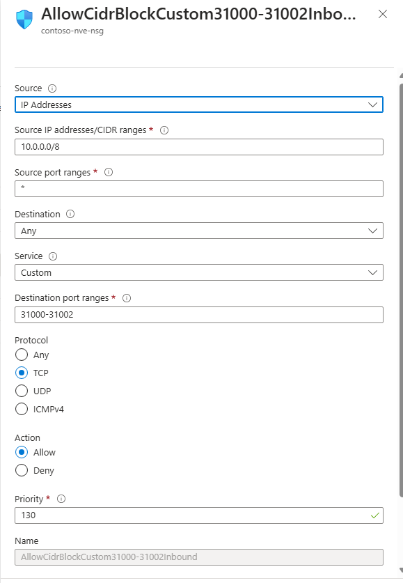
  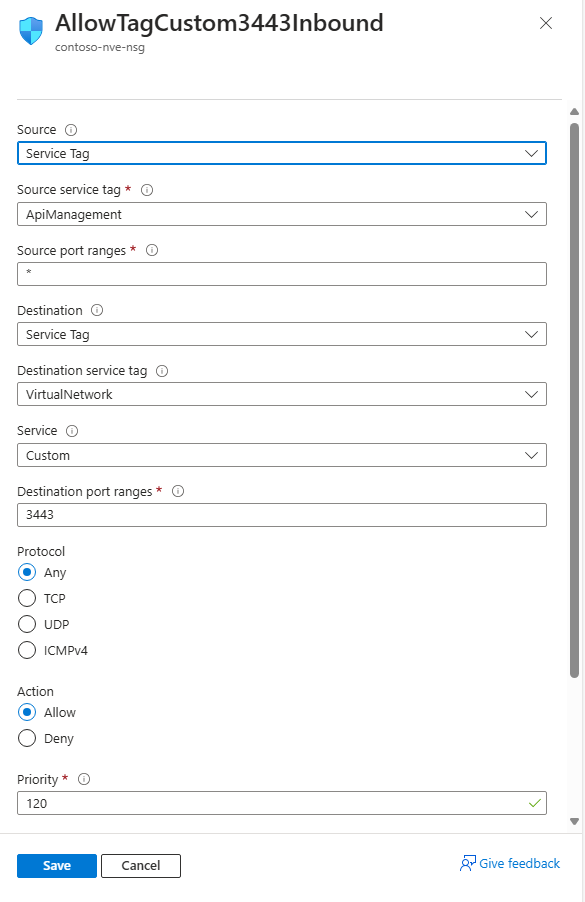

  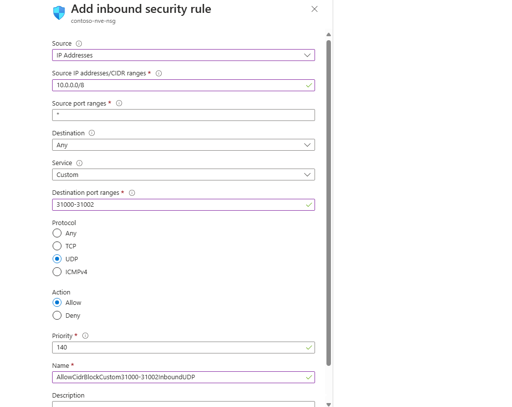

In summary the following network rules should have been created, according to image below:
  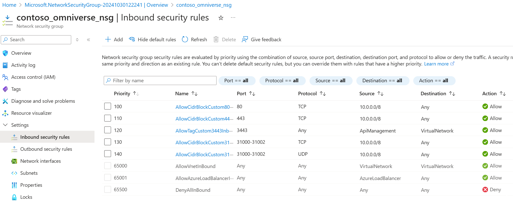

####  2.6.6. <a name='Assigntosubnetssubnet-aksandsubnet-apim'></a>*Assign to subnets 'subnet-aks' and 'subnet-apim'* 

- Navigate to the `contoso-omniverse-nsg`
- click on Settings and then Subnets to navigate to “contoso-omniverse-nsg | Subnets” page. 
- Click on “+ Associate”. On the “Associate subnet” dialog box, select “contoso-omniverse-vnet” as the virtual network 
and “subnet-aks” as the subnet to associate the network security group.  
- Repeat the same process to associate the network security group to subnet “subnet-apm”

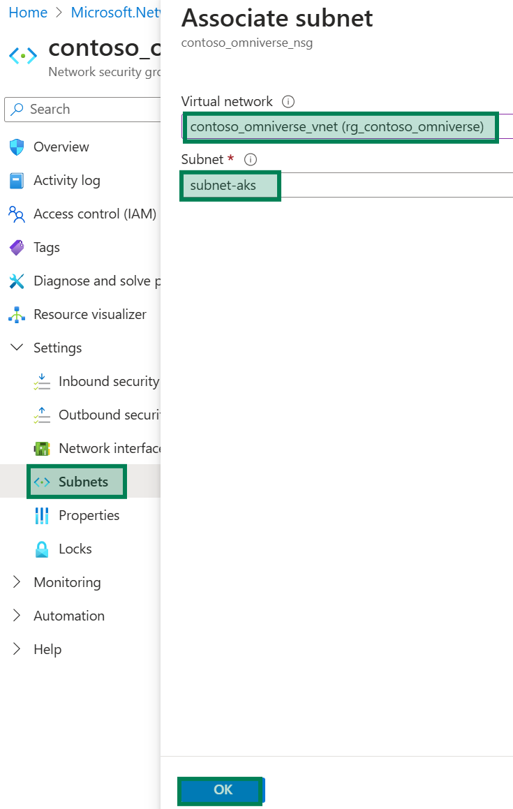
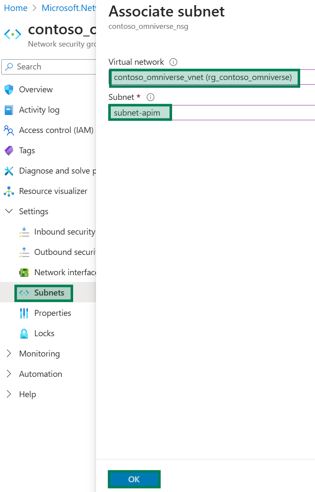

In summary the assignment should be similar to this:

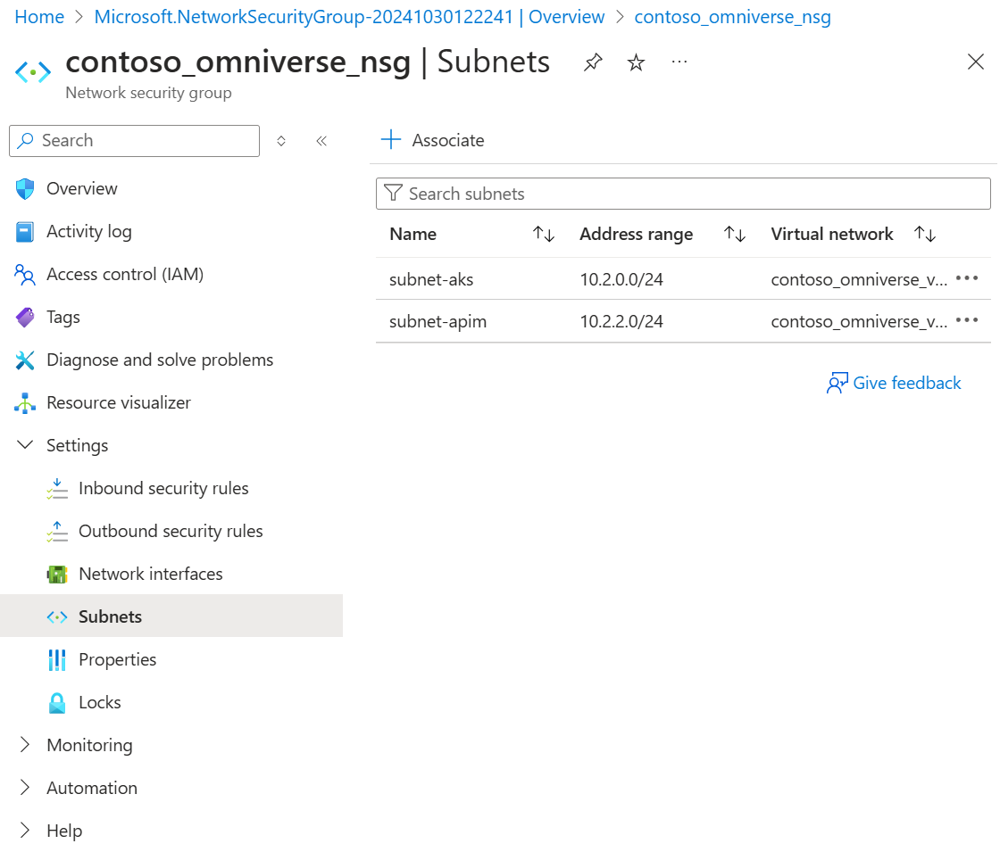

###  2.7. <a name='DNSandCertificateConfiguration'></a>DNS and Certificate Configuration

These may be long lead items as they may require additional IT/Networking approvals.

To access from Internet requires permissions to insert DNS ‘A’ Record.

Requires Certificate Authority (CA) signed certificate, as self-signed certificates may not be sufficient for public DNS.

####  2.7.1. <a name='Createself-signedcertificatesforprivateDNSzone'></a>*Create self-signed certificates for private DNS zone*

In the below commands, the private DNS zone is contoso-ov-kitappstreaming.net. Use following Bash script to generate both a root and SSL certificate:

1. Execute the following. Make changes to the CN

```Shell
# Generate a private key.
openssl genrsa -out contoso-ov-kitappstreaming-net-signing-root.key 4096

# Create a self-signed root certificate.
openssl req -x509 -new -nodes -key contoso-ov-kitappstreaming-net-signing-root.key -sha256 -days 1825 -out contoso-ov-kitappstreaming-net-signing-root.crt -subj "/CN=contoso-ov-kitappstreaming-net-signing-root"
```

2. Execute the following commands. Make changes to the DNS Name. Make changes to the CN. 

```Shell
# Create a private key for the wildcard SSL certificate:
openssl genrsa -out contoso-ov-kitappstreaming-ssl.key 2048

# Create a Certificate Signing Request (CSR):
openssl req -new -key contoso-ov-kitappstreaming-ssl.key -out contoso-ov-kitappstreaming-ssl.csr -subj "/CN=\*.contoso-ov-kitappstreaming.net" -addext "subjectAltName=DNS:contoso-ov-kitappstreaming.net,DNS:\*.contoso-ov-kitappstreaming.net"

# Sign the SSL certificate with the root certificate:
openssl x509 -req -in contoso-ov-kitappstreaming-ssl.csr -CA contoso-ov-kitappstreaming-net-signing-root.crt -CAkey contoso-ov-kitappstreaming-net-signing-root.key -CAcreateserial -out contoso-ov-kitappstreaming-ssl.crt -days 825 -sha256 -extfile <(printf "subjectAltName=DNS:contoso-ov-kitappstreaming.net,DNS:\*.contoso-ov-kitappstreaming.net") 
 ```

3. Execute the following commands to create the two certificates. These will be stored in the directory you are currently in.  

```Shell
# Export CER of the root and SSL certs2. 

openssl x509 -in contoso-ov-kitappstreaming-net-signing-root.crt -out contoso-ov-kitappstreaming-signing-root.cer  

openssl x509 -in contoso-ov-kitappstreaming-ssl.crt -out contoso-ov-kitappstreaming-ssl.cer
```

4. Edit the password argument and execute the following commands to create the two certificates. These will be stored in the directory you are currently in. NOTE: Password is required. 

```Shell
# Export PFX of the root and SSL certs

openssl pkcs12 -export -out contoso-ov-kitappstreaming-signing-root.pfx  -inkey contoso-ov-kitappstreaming-net-signing-root.key -in contoso-ov-kitappstreaming-net-signing-root.crt -password pass:<password>

openssl pkcs12 -export -out contoso-ov-kitappstreaming-ssl.pfx -inkey contoso-ov-kitappstreaming-ssl.key -in contoso-ov-kitappstreaming-ssl.crt -certfile contoso-ov-kitappstreaming-net-signing-root.crt -password pass:<password>
```

####  2.7.2. <a name='CreateLetsEncryptcertificatesmanuallyforpublicDNSzone'></a>*Create LetsEncrypt certificates manually for public DNS zone*

Create LetsEncrypt certificates manually for public DNS zone [https://certbot.eff.org/](https://certbot.eff.org/)

Change the domains to your public DNS. In the following examples, `kitstreaming.iai-contoso.com` is the public DNS zone.

```Shell
$ sudo certbot certonly --manual --preferred-challenges=dns --email user@nvidia.com --server https://acme-v02.api.letsencrypt.org/directory --agree-tos -d kitstreaming.iai-contoso.com -d '*.kitstreaming.iai-contoso.com' 
```

This process requires access to the zone in order to manually create and verify TXT records. The certificates will be created in `/etc/letsencrypt/live/<Public DNS Zone>`

Example output:  

```Shell
$ sudo certbot certonly --manual --preferred-challenges=dns –email user@nvidia.com --server https://acme-v02.api.letsencrypt.org/directory --agree-tos -d kitstreaming.iai-contoso.com -d '*.kitstreaming.iai-contoso.com' Saving debug log to /var/log/letsencrypt/letsencrypt.log

   - - - - - - - - - - - - - - - - - - - - - - - - - - - - - - - - - - - - Would you be willing, once your first certificate is successfully issued, to share your email address with the Electronic Frontier Foundation, a founding partner of the Let's Encrypt project and the non-profit organization that develops Certbot? We'd like to send you email about our work encrypting the web, EFF news, campaigns, and ways to support digital freedom.

 - - - - - - - - - - - - - - - - - - - - - - - - - - - - - - - - - - - - - (Y)es/(N)o: Y

Account registered.

Requesting a certificate for kitstreaming.iai-contoso.com and *.kitstreaming.iai-contoso.com

- - - - - - - - - - - - - - - - - - - - - - - - - - - - - - - - - - - - Please deploy a DNS TXT record under the name: _acme-challenge.kitstreaming.iai-contoso.com with the following value: 

EdO-qo1kRstJ6lGiwRI9fm-UBByVsmUN9Tfb_hVOBTs

 - - - - - - - - - - - - - - - - - - - - - - - - - - - - - - - - - - - - - 

Press Enter to Continue

- - - - - - - - - - - - - - - - - - - - - - - - - - - - - - - - - - - - 

Please deploy a DNS TXT record under the name:

 _acme-challenge.kitstreaming.iai-contoso.com. with the following value:

 0mw0aeygcGwx1Q1SRug1z_u3dRrU_QEL-KOHnMhmCUY

(This must be set up in addition to the previous challenges; do not remove, replace, or undo the previous challenge tasks yet. Note that you might be asked to create multiple distinct TXT records with the same name. This is permitted by DNS standards.)
```

 Before continuing, verify the TXT record has been deployed. Depending on the DNS provider, this may take some time, from a few seconds to multiple minutes. You can check if it has finished deploying with aid of online tools, such as the Google Admin Toolbox: [https://toolbox.googleapps.com/apps/dig/\#TXT/\_acme-challenge.kitstreaming.iai-contoso.com.](https://toolbox.googleapps.com/apps/dig/#TXT/_acme-challenge.contoso.ovas.omniverse.nvidia.com.·)

Look for one or more bolded line(s) below the line ';ANSWER'. It should show the value(s) you've just added.   

Add the record in DNS Management > Recordsets and verify that the record shows up with the link provided in the command output above.
👀👀
<!-- TODO Drew to provide these two images -->
![][image24]  
![][image25]

Once you have verified that the TXT entry shows up press Enter. If this fails, try running the command again or waiting longer.

####  2.7.3. <a name='Createa.pfxfromthefullchaincertificateandprivatekey'></a>*Create a .pfx from the full chain certificate and private key*
Note: When creating this certificate, a password is required. 

```Shell
$ openssl pkcs12 -export -in /etc/letsencrypt/live/kitstreaming.iai-contoso.com/fullchain.pem -inkey /etc/letsencrypt/live/kitstreaming.iai-contoso.com/privkey.pem -out kitstreaming.iai-contoso.com.pfx
```
Your file will be named `<Public DNS Zone>.pfx`. Change the value after `-out` to name it differently. Save the location of this file, as it will need to be uploaded later.

###  2.8. <a name='AKSClusterConfiguration'></a>AKS Cluster Configuration

In this step the Azure Kubernetes cluster is created and configured. The technology stack running on Kubernetes
requires 3 types of Worker Nodes:
1. General Compute: These worker nodes run the API and other services
2. Memory Optimized: These worker nodes run the memcached service
3. NVIDIA GPU: These worker nodes run the Omniverse Kit Application pods.

Above worker nodes are created in this section as AKS Node Pools. In order to learn more about the supported instance
types and requirements, please visit the NVIDIA [documentation](https://docs.omniverse.nvidia.com/ovas/latest/deployments/infra/requirements.html#kubernetes-worker-nodes).

Please ensure your Azure subscription is configured with the appropriate [quota](https://learn.microsoft.com/en-us/azure/quotas/) 
to provision Azure virtual machines for the following AKS node pool configurations :

* Control Plane 

  * Node Pool Name: agentpoolds

  * VM SKU: Standard D4s V3 (or larger)

  * Minium Quota Quantity: 2 VMs 

* Cache Layer 

  * Node Pool Name: cachepool

  * VM SKU: Standard D8S V3

  * Minimum Quota Quantity: 1 VM

* GPU Compute

  * Node Pool Name: gpupool

  * VM SKU: Standard NV36ads A10 V5

  * Minimum Quota Quantity: 1 VM

####  2.8.1. <a name='CreateAKSCluster'></a>*Create AKS Cluster*
To provision the AKS cluster: 
- Start by search & select “Kubernetes Services” in the Azure Portal top search box
- Click “Create” -> “Kubernetes cluster”.
- In the creation form, select the previously created resource group e.g. `rg_contoso_omniverse`
- Select the Cluster preset configuration `Dev,Test`
- Define a name for the Kubernetes cluster e.g. `contoso-aks`
- Select the same region, as for previous resources e.g. `US South Central US`
- Select Kubernetes version `1.29.9`
- Select for Authentication and Authorization `Microsoft Entra ID authentication with Azure RBAC`
- Below image shows an example of a filled form. 
- Do **NOT** click “Review + Create” yet, as we need to pre-configure Node pools and networking as part of creating the AKS cluster in the next step.
- Navigate with **Next** to the `Node pools` configuration

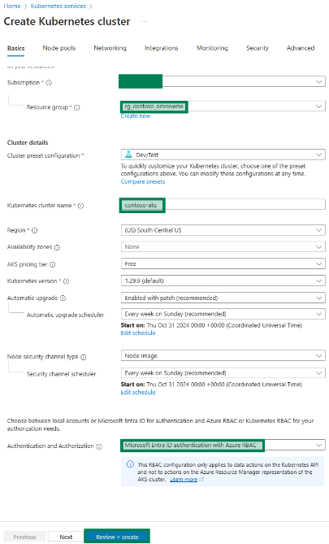

####  2.8.2. <a name='CreateNodepools'></a>*Create Nodepools*

We will create three node pools as part of the AKS cluster configuration i.e. Agent pool, Cache pool and GPU pool with 
Azure VM SKU Types described in the introductory segment of AKS cluster configuration.

- Update the existing agent pool by
  - Change the Scale method to `Manual`
  - Set the Node Count to `2` (ensure with the combination of node type and node count the relevant pods can run)
  - Set max pods per node to `30`

- Create a new nodepool for caching:
  - Name: `cachepool`
  - Mode: `User`
  - OS SKU: `Ubuntu Linux`
  - Node size: `Standard_D8s_v3`
  - Scale Method: `Manual`
  - Node count: `1`

- Create a new nodepool for the gpu nodes:
  - Name: `gpupool`
  - Mode: `User`
  - OS SKU: `Ubuntu Linux`
  - Node size: `Standard NV36ads A10 v5`
  - Scale Method: `Manual`
  - Node count: `1`

Sample forms of the node pool configurations provided below for quick reference. 

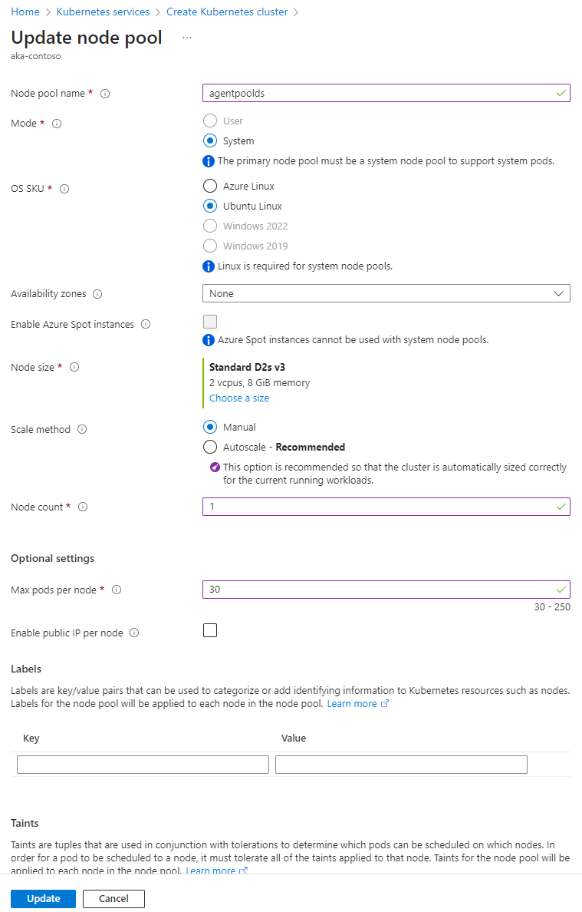
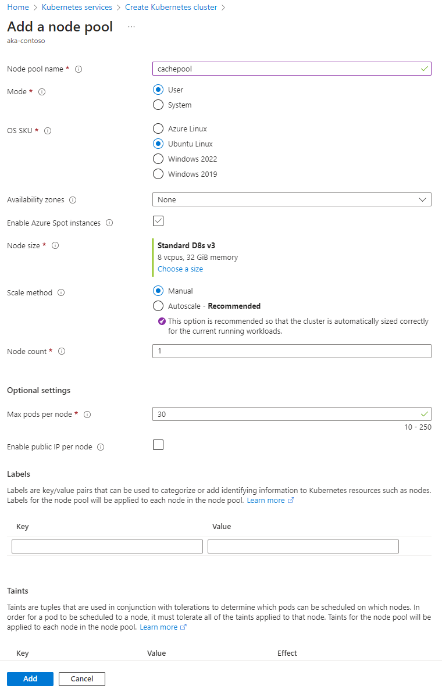 

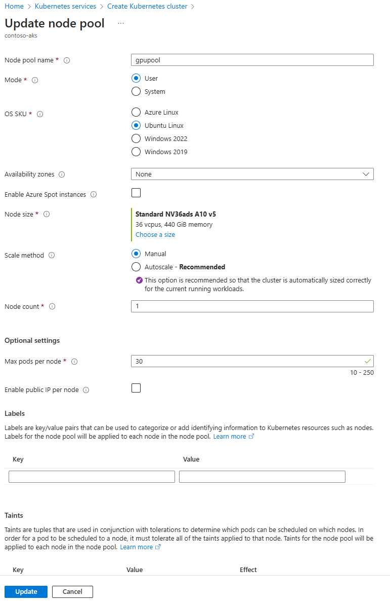

In summary your node pools should look similar to this:

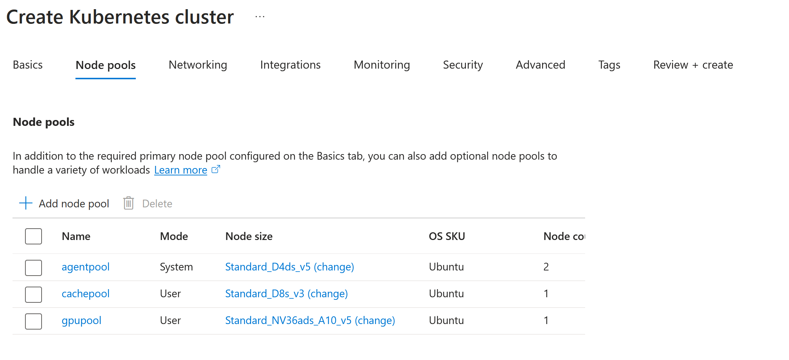

- Please ensure you have sufficient capacity quota granted to your subscription. 
- If required please open Azure support ticket to seek capacity allocation as described in [quickstart-increase-quota-portal](https://learn.microsoft.com/en-us/azure/quotas/quickstart-increase-quota-portal).
- Once the node pools are configured, move onto the “Networking” tab to connect AKS cluster with the pre-created Virtual Network associated with necessary Network Security group rules.
-------------------------------
####  2.8.3. <a name='ConfigureNetworking'></a>*Configure Networking*

- Select `Azure CNI Node Subnet` option for the Container Networking
- Select `Bring your own Azure virtual network`
- Select the previously created virtual network e.g. `contoso_omniverse_vnet`
- Select as Cluster subnet the previously created subnet e.g. `subnet-aks`

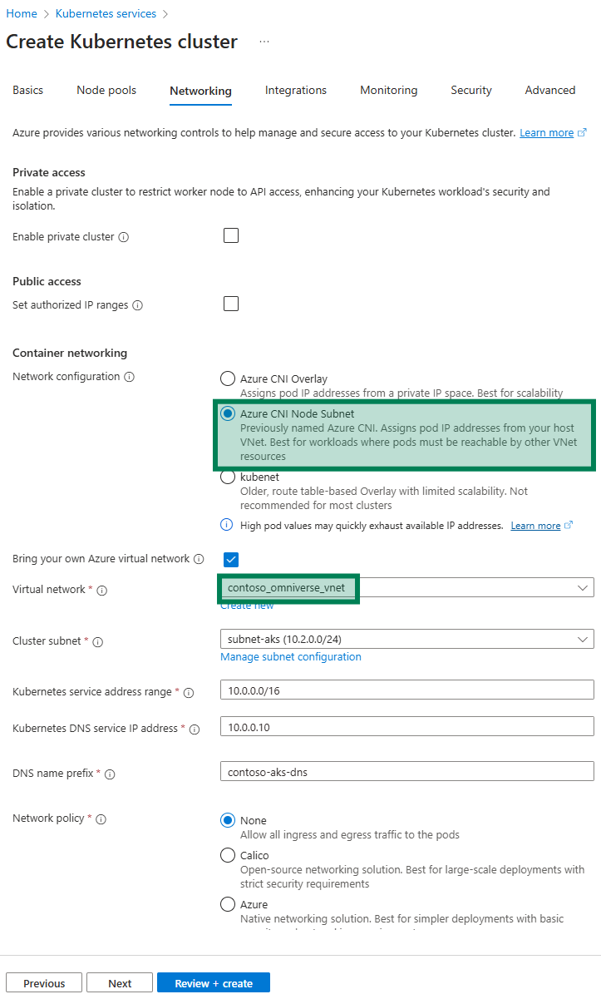

####  2.8.4. <a name='Confirmandcreatecluster'></a>*Confirm and create cluster*

Review all the configurations across the “Basics”, “Node Pools” & “Networking” tabs of the “Create Kubernetes Cluster” form.
When ready, click “Review + Create”. This step will take time as it involves provisioning compute resources as specified in the node pool configurations.  

####  2.8.5. <a name='RBACSetup'></a>*RBAC Setup*

To access the AKS Cluster and manage resources inside Kubernetes, proper role assignments within the resource group must be completed.
For below steps your user needs permissions to assign roles e.g. `Owner` or the `User Access Administrator` Role, the Contributor Role is not sufficient.

Add any user here that will need access to the cluster by completing the following steps:

* Navigate to the previously created Resource Group e.g. `rg_contoso_omniverse`

* Navigate to Access control (IAM)  
  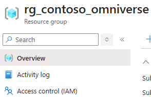 
    
* Click Add, and navigate to Add role assignment  
    
  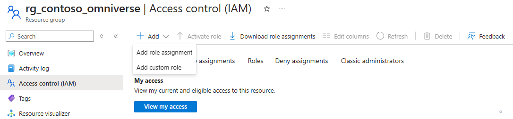  
    
* Search Azure Kubernetes Service in the role search  
* Add desired user to Azure Kubernetes Service RBAC Cluster Admin  
* Add desired user to Azure Kubernetes Service RBAC Admin

####  2.8.6. <a name='Pullkubeconfiglocallyandcheckaccess'></a>*Pull kubeconfig locally and check access*

For the following installation steps a user with `Azure Kubernetes Service RBAC Cluster Admin` is required due to
installation of various services in many namespaces.

In this step you will check your access to the Kubernetes cluster. For general guidance please review the [AKS documentation](https://learn.microsoft.com/en-us/azure/aks/tutorial-kubernetes-deploy-cluster?tabs=azure-cli#connect-to-cluster-using-kubectl).

- Ensure the correct subscription is selected with `az account set --subscription <subscription-id>`
- Log in to the Azure CLI with `az login`.

```shell
$ az aks get-credentials --format azure --resource-group rg_contoso_omniverse --name aks-contoso

$ export KUBECONFIG=/home/${USER}/.kube/config

$ kubelogin convert-kubeconfig –l azurecli

$ kubectl get nodes
```

In the next step you can run some `kubectl` commands to list nodes, pods and cluster information to ensure you are connected to the right cluster.

List existing nodes:

```Shell
$ kubectl get nodes -o wide
NAME                                STATUS   ROLES    AGE    VERSION   INTERNAL-IP   EXTERNAL-IP   OS-IMAGE             KERNEL-VERSION      CONTAINER-RUNTIME
aks-agentpool-34877641-vmss000000   Ready    <none>   7h3m   v1.29.9   10.2.0.62     <none>        Ubuntu 22.04.5 LTS   5.15.0-1073-azure   containerd://1.7.22-1
aks-agentpool-34877641-vmss000001   Ready    <none>   7h3m   v1.29.9   10.2.0.33     <none>        Ubuntu 22.04.5 LTS   5.15.0-1073-azure   containerd://1.7.22-1
aks-cachepool-34877641-vmss000000   Ready    <none>   7h3m   v1.29.9   10.2.0.91     <none>        Ubuntu 22.04.5 LTS   5.15.0-1073-azure   containerd://1.7.22-1
aks-gpupool-34877641-vmss000000     Ready    <none>   7h3m   v1.29.9   10.2.0.4      <none>        Ubuntu 22.04.5 LTS   5.15.0-1073-azure   containerd://1.7.22-1
```

You should see worker nodes corresponding to the agent nodes, caching nodes and gpu nodes configured in the node pools.

List cluster information, you should see an output similar to this for your cluster e.g. `contoso-aks`:

```Shell
$ kubectl cluster-info
Kubernetes control plane is running at https://contoso-aks-ocrmfdj1.hcp.southcentralus.azmk8s.io:443
CoreDNS is running at https://contoso-aks-dns-ocrmfdj1.hcp.southcentralus.azmk8s.io:443/api/v1/namespaces/kube-system/services/kube-dns:dns/proxy
Metrics-server is running at https://contoso-aks-dns-ocrmfdj1.hcp.southcentralus.azmk8s.io:443/api/v1/namespaces/kube-system/services/https:metrics-server:/proxy
```

###  2.9. <a name='APIManagementService'></a>API Management Service

####  2.9.1. <a name='CreateAPIMService'></a>*Create APIM Service*

In this step the [Azure API Management Service](https://learn.microsoft.com/en-us/azure/api-management/) is deployed
and configured. The configuration will be tied together with an [Application Gateway](https://learn.microsoft.com/en-us/azure/api-management/api-management-howto-integrate-internal-vnet-appgateway).

- Start by searching for “API Management services” in the Azure Portal top search box
- Select “API Management Services” option from the result list to navigate to “API Management Services” screen 
- Click “+ Create” on the “API Management Services” screen to navigate to “Create API Management service” screen. 
- Populate “Basics” tab with information as shown in the screenshot.
  - Select the previously created resource group
  - Select the region, e.g. `US South Central US`
  - Select Pricing Tier `Developer (no SLA)`
- Please do **NOT** click “Review + Create” yet, as we need configure a virtual network for the service in the “Virtual Network” tab.


- Hit `Next` to navigate to the Monitor and Secure tab
- Hit `Next` to navigate to the `Virtual network` tab
  - Set as Connectivity Type `Virtual Network`
  - Set as Type `Internal`
  - Select the previously created virtual network
  - Select the previously created Subnet, e.g. `subnet-apim`
- Hit `Review and create` to create the API Management Service Instance


####  2.9.2. <a name='ConfigureCustomDomainandPrivateDNSZone'></a>*Configure Custom Domain and Private DNS Zone*

1. Once deployed, add a custom domain:   
   1. Select Custom Domains under Deployment and Infrastructure  
      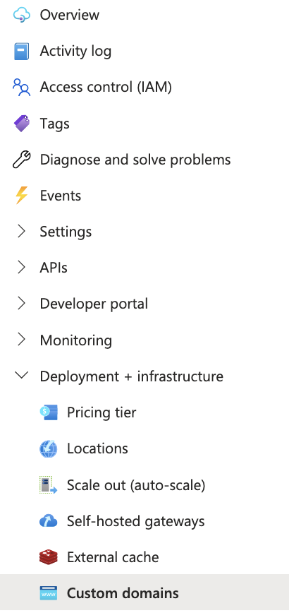 
   2. Add a new custom domain for the gateway:   
      * **Type**: Gateway  
      * **Hostname**: [apim-gw.contoso-ov-kitappstreaming.net](http://apim-gw.ovas-streaming.net/)     ← This should be apim-gw.\<your private DNS\>  
      * **Certificate**: Custom  s
      * **Certificate file**: contoso-ov-kitappstreaming-ssl.pfx  ← This is the self-signed certificate that was created previously  
      * **Check** Default SSL binding  
          
        
   3. Add a new custom domain for the management gateway:   
      * **Type**: Management  
      * **Hostname**: [apim-mgmt.contoso-ov-kitappstreaming.net](http://apim-mgmt.ovas-streaming.net/)    ← This should be apim-mgmt.\<your private DNS\>  
      * **Certificate**: Custom  
      * **Certificate file**: contoso\-ov-kitappstreaming-ssl.pfx ← This should be what the SSL certificate file was named previously.  
        

      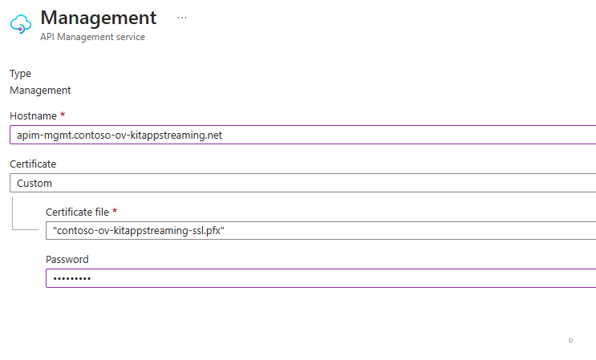

   *Note*: These settings can take up to an hour to apply

2. Add DNS records to private DNS zone:   
   1. Add two **A records** for apim-gw and apim-mgmt to previously created private DNS zone pointing to private IP of the APIM instance created previously.

###  2.10. <a name='ApplicationGatewayServicewithWebApplicationFirewall'></a>Application Gateway Service with Web Application Firewall

To provision the Application Gateway service, start by searching for “Application Gateway” in the Azure Portal top search box 
and select “Application Gateways” option from the result list to navigate to “Load Balancing | Application Gateway” screen.

Click on “+ Create” button on this screen and navigate to the “Create application gateway” screen. 
Provide information in the “Basics” tab as shown in the screenshot example of a filled form.

Please do **NOT** click “Review + Create” yet, as we need configure “Frontends”, “Backends”, and “Configuration” tabs 
in the subsequent steps.

**Basics**

* **Tier:** WAFv2  
* **Autoscaling:** (optional) min 2, max 3  
* **Policy:** Create new (can use defaults)  
* **Vnet:** Created in step 1  
* **Subnet:** subnet-waf

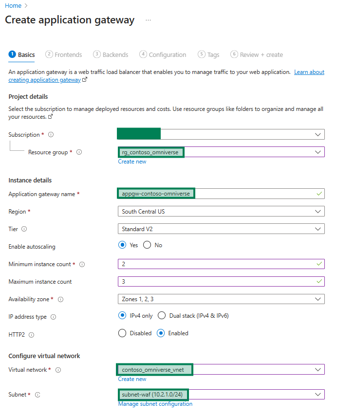

**Frontends**

* **Type**: both  
* **Public IP**: Create new  
* **Private IP**: Choose IP in private subnet range (e.g. 10.2.1.10)

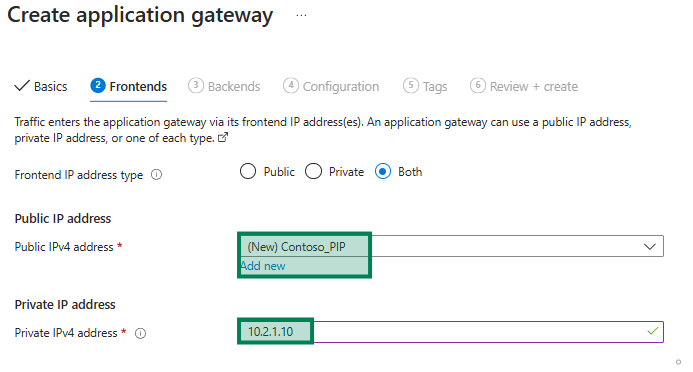

**Backends**

Create new

* **Name**: apim  
* **Backend target**: apim-gw.contoso-ov-kitappstreaming.net ← This should be apim-gw.\<your private DNS\>

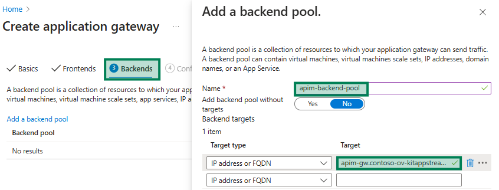

**Configuration**

Add new routing rule

* **Name**: waf-to-apim-internal  
* Priority 100  
* Listener  
  * **Name**: http  
  * **Frontend IP:** public IPv4  
  * **Protocol**: http  
  * **Port**: 80

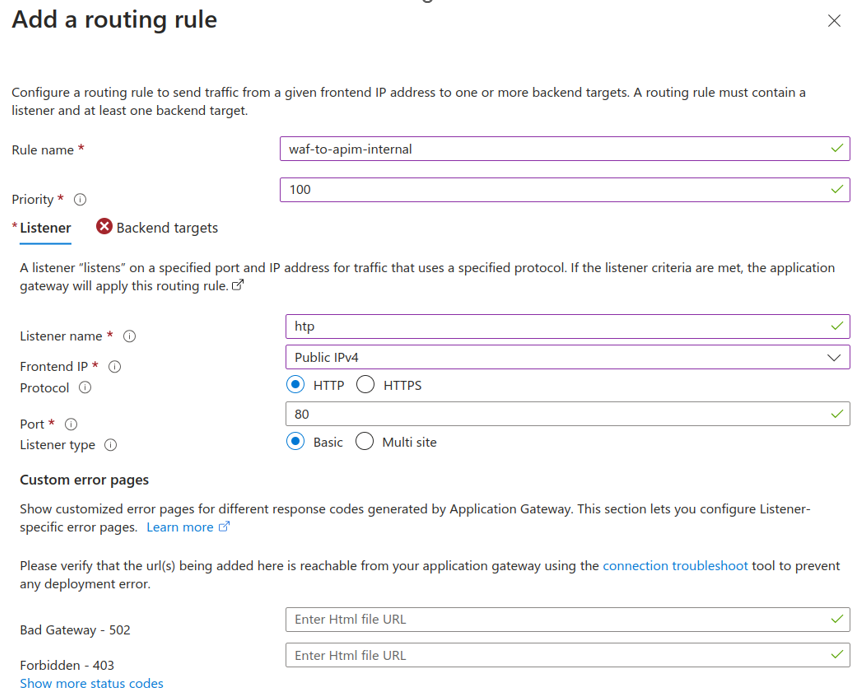

**Backend targets**

* **Target**: apim (backend created above)  
* Create new backend setting  
* **Name:** https-internal  
* **Protocol:** https  
* **Server certificate is signed by well-known authority:** No  
* **CER certificate:** ov-kitappstreaming-signing-root.cer  
* **Override with new host name:** Yes  
* Select Pick hostname from backend target  
* **Create custom probes:** Yes

Example:

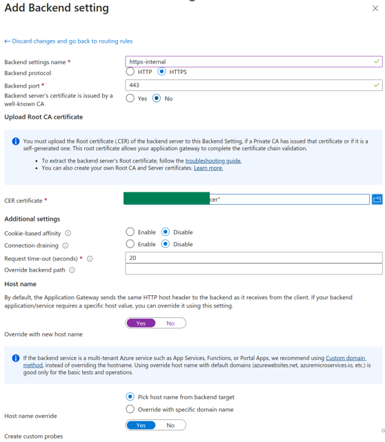

**Once deployed go to app gateway:**

**Health Probe**

Click Settings > Health Probe. Click the test and check that it works.

* **Name**: https  
* **Pick hostname from backend settings:** Yes  
* **Path**: /status-0123456789abcdef  
* **Use probe matching conditions**: Yes  
* **Backend settings**: choose existing one  
* Test the probe; it should be successful  
* Click Add

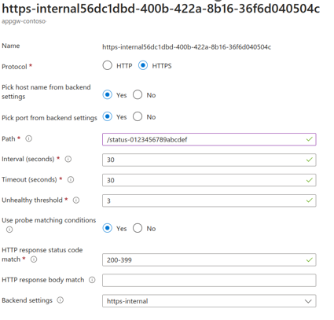

**HTTPS Listener**

Add a new HTTPS listener (optional; adds TLS termination at AppGw)

* Under Settings > Listeners, click + Add Listener  
  * **Name**: https  
  * **Frontend IP**: public  
  * **Protocol**: https  
  * **Certificate**: Upload a certificate  
  * **Name**: contoso-ov-kitappstreaming  
  * **PFX Certificate File:** (.pfx file created earlier)  
  * **Password**:  
  * **Listener type:** Multi site  
  * **Host type:** Multiple/Wildcard  
  * **Host names**:  
    * kitstreaming.iai-contoso.com  
    * \*.kitstreaming.iai-contoso.com

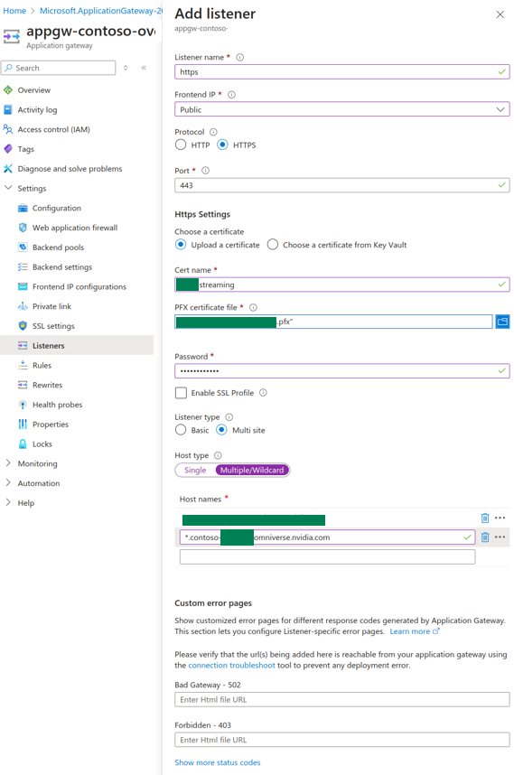


If it shows “Failed to save application gateway changes”:

```Shell
$ sudo chmod 777 kitstreaming.iai-contoso.com.pfx
```

**Routing Rules**

Under Settings > Rules, click + Routing rule

* **Name**: https

* **Priority**: 10

* **Listener**: https	

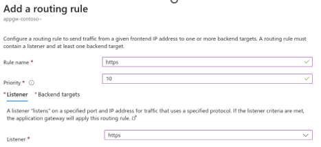

**Backend pool**	

* **Backend target**: apim

* **Backend settings**: https-internal

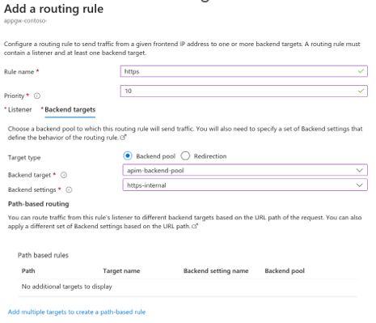

Under Settings > Rules, click `waf-to-apim-internal`

**Backend targets**

* Change Target type from Backend pool to Redirection

* **Target listener:** https

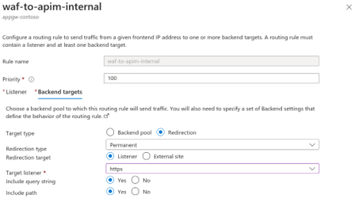

## 

**Post Deployment:**

If your APIM service is not yet finished deploying with post deployment steps, you will see an error on the AppGW with something like "Unhealthy backend pools". Once AppGW APIM is deployed, you should no longer have this error. Try testing the health probe if this problem continues and make sure that the URLs you added are configured correctly.

**RBAC**

Assign RBAC permissions to enterprise app registration created by AKS cluster

* Find the vnet created in step 1

* Under Access control (IAM), click Check access

  * Search for the cluster name after selecting Managed Identities and add the managed identity of the AKS cluster

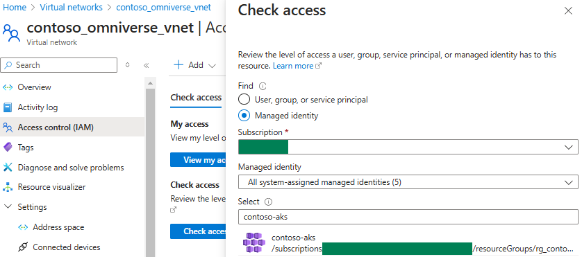
-------------------------------------
##  3. <a name='OmniverseKitAppStreamingDeploymentandConfiguration'></a>Omniverse Kit App Streaming Deployment and Configuration

In this section the NVIDIA Kit App Streaming stack is deployed and configured on AKS. This includes the steps to

1. Install the Kit App Streaming technology stack on AKS with Helm
2. Customize and integrate the Configuration with custom domains, TLS, etc.
3. Creation of an Azure Container Registry to host custom Omniverse Kit Application Images
4. Creation and deployment of a custom Omniverse Kit Application

Please visit [Omniverse Application Streaming API documentation](https://docs.omniverse.nvidia.com/ovas/latest/index.html
for further details.
This section follows the installation steps outlined in https://docs.omniverse.nvidia.com/ovas/latest/deployments/infra/installation.html.
For questions and support please reach out via https://docs.omniverse.nvidia.com/ovas/latest/common/feedback.html

###  3.1. <a name='OptionalMoveExternalDependenciestoyourownartifactstorage'></a>(Optional) Move External Dependencies to your own artifact storage

This installation guide assumes you are sourcing and installing the Kit App Streaming API services with their
Helm Charts and container images from [NVIDIA NGC](https://ngc.nvidia.com/). Besides this several other public resources
are used for dependencies like [Flux](https://fluxcd.io/). In case you want your installation to refer to your own
image and Helm repositories, please copy the needed artifacts to your own repository and configure the AKS cluster
to access the needed resources.

You can find links and details on the Helm Charts and Images needed in the [NGC Collection for Omniverse Application Streaming API](https://catalog.ngc.nvidia.com/orgs/nvidia/teams/omniverse/collections/kit-appstreaming-collection)

###  3.2. <a name='DownloadSampleandResourcesFiles'></a>Download Sample and Resources Files

For installing the needed services, NVIDIA provides sample Helm `values.yaml` files and Custom Resource Definition (CRD)
files used to configure in later steps the Kit Applications.

- Create a new working directory `kas_installation`
- Download the [Samples and Resources files](https://catalog.ngc.nvidia.com/orgs/nvidia/teams/omniverse/resources/kit-appstreaming-resources/files) 
- Extract the downloaded files and place them in your working directory
- Your folder structure should look similar to this with the downloaded files:

```shell
├── flux2
│   └── values.yaml
├── kas-usd-viewer-application
│   ├── Chart.yaml
│   ├── charts
│   ├── templates
│   │   ├── application-profile-tgb.yaml
│   │   ├── application-version.yaml
│   │   └── application.yaml
│   └── values.yaml
├── kit-appstreaming-applications
│   ├── values.yaml
│   └── values_aws_api_gateway.yaml
├── kit-appstreaming-aws-nlb
│   ├── values.yaml
│   └── values_aws_api_gateway.yaml
├── kit-appstreaming-manager
│   ├── values_aws_tgb.yaml
│   ├── values_generic.yaml
│   └── values_generic_aws_api_gateway.yaml
├── kit-appstreaming-rmcp
│   └── values.yaml
└── memcached
    └── values.yml

```

These files are needed in the following steps, and also need to be modified to accommodate your installation environment.

###  3.3. <a name='CreateKubernetesNamespace'></a>Create Kubernetes Namespace

The solution currently requires the creation of one new Kubernetes namespace to deploy various resources. 
For simplicity, this document assumes the namespace `omni-streaming` is created and used.

- Run `kubectl create namespace omni-streaming`

NOTE: Section on Image pull secret 

###  3.4. <a name='CreateImageRegistryPullSecret'></a>Create Image Registry Pull Secret

During the setup of the pre-requisites, you created a `NGC API TOKEN`. This API token is used by Kubernetes
during later installation steps to download the necessary images from NGC. In case you want to leverage images copied
to your own image repositories, please adapt the secrets accordingly.

- For convenience, you can export your NGC API Token as an environmental variable in your console by using `set`(Windows Shell) or `export`(Linux Shell) e.g
  - Linux: `export NGC_API_TOKEN=YOUR_NGC_API_TOKEN`
  - Windows: `set NGC_API_TOKEN=YOUR_NGC_API_TOKEN`
- Please follow these [steps](https://docs.omniverse.nvidia.com/ovas/latest/deployments/infra/installation.html#create-image-registry-pull-secret) 
to create the image pull secret.

Example instructions and console output:

```shell

$ kubectl create secret -n omni-streaming docker-registry regcred \
    --docker-server=nvcr.io \
    --docker-username='$oauthtoken' \
    --docker-password=$NGC_API_TOKEN \
    --dry-run=client -o json | \
    kubectl apply -f -
secret/regcred created

```

###  3.5. <a name='InstallNVIDIAGPUOperatoronAKS'></a>Install NVIDIA GPU Operator on AKS

The [NVIDIA GPU Operator](https://docs.nvidia.com/datacenter/cloud-native/gpu-operator/latest/getting-started.html#operator-install-guide) is needed to discover, label and install drivers
on your NVIDIA GPU K8S Worker nodes.

- Please follow [these instructions](https://docs.omniverse.nvidia.com/ovas/latest/deployments/infra/requirements.html#installing-the-nvidia-gpu-operator-with-helm) to install the GPU Operator on your AKS Cluster
- Ensure to only use the supported driver versions

Example instructions and console output:

```shell
$ helm install --wait --generate-name \
   -n gpu-operator --create-namespace \
   --repo https://helm.ngc.nvidia.com/nvidia \
   gpu-operator \
   --set driver.version=535.104.05

NAME: gpu-operator-1731594276
LAST DEPLOYED: Thu Nov 14 15:24:43 2024
NAMESPACE: gpu-operator
STATUS: deployed
REVISION: 1
TEST SUITE: None

```

###  3.6. <a name='InstallMemcachedonAKS'></a>Install Memcached on AKS

Memcached is a critical component for enabling fast startup of Kit streaming sessions. 
It caches shader information that would otherwise need to be compiled at the startup of each container.
You can find more information on Shader Caching in the [NVIDIA documentation](https://docs.omniverse.nvidia.com/ovas/latest/architecture/shader-cache.html#shared-shader-caching).

In the next step the `values.yaml` for Memcached, which was provided with the downloaded sample files, needs to be modified 
to ensure that the memcached Pods run on the desired memory optimized nodes (e.g `cachepool`). This is done by updating values
which translate into [nodeSelector](https://kubernetes.io/docs/concepts/scheduling-eviction/assign-pod-node/#nodeselector) terms
which help Kubernetes schedule(run) memcached pods on the AKS cachepool K8S worker nodes.

- Open the downloaded `values.yaml` file for memcached in your working directory e.g. `helm/memcached/values.yml`
- In the file you will find the following section:

```yaml
nodeSelector:
  NodeGroup: cache
```

- Rename the key `NodeGroup` to `agentpool`
- Rename the value `cache` to `cachepool`

The additional worker nodes `agentpool` created in this setup have the [Kubernetes Label](https://kubernetes.io/docs/concepts/overview/working-with-objects/labels/) 
`agentpool=cachepool` set for them. You can find the labels of your worker nodes by executing `kubectl get nodes --show-labels | grep agentpool` 
and looking for the label value, or by using `kubectl describe` on your worker node.

<details>
  <summary>Your final values.yaml file for memcached should look now similar to this:</summary>
  
```yaml
args:
  - /run.sh
  - -m 10240m
  - -I 1024m
resources:
  limits:
    memory: 20Gi
    cpu: 4
  requests:
    memory: 10Gi
    cpu: 2
extraEvnVars:
  - name: MEMCACHED_MAX_CONNECTIONS
    value: 2000
  - name: MEMCACHED_THREADS
    value: 8
nodeSelector:
  agentpool: cachepool
replicaCount: 1
service:
  clusterIP: None
architecture: high-availability

  ```

</details>

After above change, you are now ready to install memcached on your Kubernetes cluster.

- Ensure you are in your working directory to reference the `values.yaml` file you modified in the next steps helm installation.
- Please follow [these instructions](https://docs.omniverse.nvidia.com/ovas/latest/deployments/infra/installation.html#install-memcached-service)
to install the memcached service.

<details>
  <summary>Example commands and console outputs:</summary>
  
```shell
$ helm upgrade --install \
  -n omni-streaming --create-namespace \
  -f helm/memcached/values.yml \
  --repo https://charts.bitnami.com/bitnami \
  memcached-service-r3 memcached

Release "memcached-service-r3" does not exist. Installing it now.
NAME: memcached-service-r3
LAST DEPLOYED: Fri Nov 15 10:07:01 2024
NAMESPACE: omni-streaming
STATUS: deployed
REVISION: 1
TEST SUITE: None
NOTES:
CHART NAME: memcached
CHART VERSION: 7.5.2
APP VERSION: 1.6.32

** Please be patient while the chart is being deployed **

Memcached can be accessed via port 11211 on the following DNS name from within your cluster:

    memcached-service-r3.omni-streaming.svc.cluster.local

```
</details>

###  3.7. <a name='InstallFluxonAKS'></a>Install Flux on AKS

The components of the CNCF project Flux are used to manage the deployment of streaming applications. 
This approach makes the deployment and the management of Helm repositories and the resources more declarative and easier to manage.

In the next step the `values.yaml` for Flux2, which was provided with the downloaded sample files, needs to be modified 
to ensure that the Flux Pods run on the desired Nodes (our default agentpool/CPU nodes). This is done by updating values
which translate into [nodeSelector](https://kubernetes.io/docs/concepts/scheduling-eviction/assign-pod-node/#nodeselector) terms
which help Kubernetes schedule(run) Flux2 pods on default CPU worker nodes.

- Open the downloaded `values.yaml` file for flux in your working directory e.g. `helm/flux2/values.yaml`
- Update **both** sections for the `helmController` and the `sourceController` in the file:

```yaml
        nodeSelectorTerms:
        - matchExpressions:
          - key: NodeGroup
            operator: In
            values:
            - system
```
- Change the `key` from `NodeGroup` to `agentpool`
- Change the `values` from `system` to `agentpool`

The default CPU worker nodes `agentpool` created in this setup have the [Kubernetes Label](https://kubernetes.io/docs/concepts/overview/working-with-objects/labels/) 
`agentpool=agentpool` set for them. You can find the labels of your worker nodes by executing `kubectl get nodes --show-labels | grep agentpool` 
and looking for the label value, or by using `kubectl describe` on your worker node.

<details>
  <summary>Your final values.yaml file for Flux should look now similar to this:</summary>
  
```yaml
helmController:
  create: true
  affinity:
    nodeAffinity:
      requiredDuringSchedulingIgnoredDuringExecution:
        nodeSelectorTerms:
        - matchExpressions:
          - key: agentpool
            operator: In
            values:
            - agentpool
imageAutomationController:
  create: false
kustomizeController:
  create: false
notificationController:
  create: false
imageReflectionController:
  create: false
policies:
  create: false
rbac:
  create: true
sourceController:
  create: true
  affinity:
    nodeAffinity:
      requiredDuringSchedulingIgnoredDuringExecution:
        nodeSelectorTerms:
        - matchExpressions:
          - key: agentpool
            operator: In
            values:
            - agentpool
  ```

</details>

After above change, you are now ready to install Flux2 on your Kubernetes cluster.

- Ensure you are your working directory to reference the `values.yaml` file you modified in the next steps helm installation.
- Please follow [these instructions](https://docs.omniverse.nvidia.com/ovas/latest/deployments/infra/installation.html#install-flux-helm-controller-and-flux-source-controller)
to install the Flux Helm Controller and Flux Source Controller.

<details>
  <summary>Example commands and console outputs:</summary>
  
```shell
$ kubectl create namespace flux-operators
namespace/flux-operators created

$ helm upgrade --install \
  --namespace flux-operators \
  -f helm/flux2/values.yaml \
fluxcd fluxcd-community/flux2

Release "fluxcd" does not exist. Installing it now.
NAME: fluxcd
LAST DEPLOYED: Fri Nov 15 00:41:10 2024
NAMESPACE: flux-operators
STATUS: deployed
REVISION: 1
TEST SUITE: None

```

</details>

###  3.8. <a name='InstallOmniverseResourceManagementControlPlaneRMCPonAKS'></a>Install Omniverse Resource Management Control Plane (RMCP) on AKS

The NVIDIA Omniverse Resource Management Control Plane Service is used to manage the deployment of streaming sessions.

- Your NGC API Token, created during the pre-requisite steps is needed again
- Follow these [steps](https://docs.omniverse.nvidia.com/ovas/latest/deployments/infra/installation.html#configuring-the-service) to create an additional secret `ngc-omni-user`.


In the next step the `values.yaml` for RMCP, which was provided with the downloaded sample files, needs to be modified 
to ensure that the RMCP Pods run on the desired default nodes (e.g `agentpool`).

- Open the downloaded `values.yaml` file for RMCP in your working directory e.g. `helm/kit-appstreaming-rmcp/values.yml`
- In the file you will find the following section:

```yaml
        nodeSelectorTerms:
          - matchExpressions:
              - key: NodeGroup
                operator: In
                values:
                  - System
```

- Change the key `NodeGroup` to `agentpool`
- Change the value `System` to `agentpool`

You can integrate the API services with Prometheus. In this guide, Prometheus integration is assumed to be **deactivated**
for simplicity. Follow below steps to deactivate the Prometheus integration:

- In the file you will find the following section:

```yaml
  monitoring:
    # -- Enables the creation of ServiceMonitor resource.
    enabled: true
    # -- Prometheus namespace.
    prometheusNamespace: "omni-streaming"
```
- Change `enabled` to `false`


<details>
  <summary>Your final values.yaml file sections for RMCP should look now similar to this:</summary>
  
```yaml

...

  affinity:
    nodeAffinity:
      requiredDuringSchedulingIgnoredDuringExecution:
        nodeSelectorTerms:
          - matchExpressions:
              - key: agentpool
                operator: In
                values:
                  - agentpool

  monitoring:
    # -- Enables the creation of ServiceMonitor resource.
    enabled: false
...

  ```

</details>

After above change, you are now ready to install RMCP on your Kubernetes cluster.

- Ensure you are your working directory to reference the `values.yaml` file you modified in the next steps helm installation.
- Please follow [these instructions](https://docs.omniverse.nvidia.com/ovas/latest/deployments/infra/installation.html#deploying-the-service)
to install RMCP.

<details>
  <summary>Example commands and console outputs:</summary>
  
```shell

$ helm upgrade --install \
  --namespace omni-streaming \
  -f helm/kit-appstreaming-rmcp/values.yaml  \
  rmcp omniverse/kit-appstreaming-rmcp
  
Release "rmcp" does not exist. Installing it now.
NAME: rmcp
LAST DEPLOYED: Fri Nov 15 12:43:44 2024
NAMESPACE: omni-streaming
STATUS: deployed
REVISION: 1
TEST SUITE: None

```

</details>

-------------------------------------------

###  3.9. <a name='CreateanddeployacustomOmniverseKitApplication'></a>Create and deploy a custom Omniverse Kit Application

####  3.9.1. <a name='UploadISVcustomkitapptoaContainerRegistry'></a>Upload ISV custom kit app to a Container Registry
The containerized kit app needs to be accessible by Kubernetes to provide the OV kit app streaming functionality, hence 
the ISV needs to use either one of their own existing container registries or create a private Azure Container Registry for this project that holds the containerized ISV Kit App.

See [APPLICATION_DEVELOPMENT.md](APPLICATION_DEVELOPMENT.md) to create the required containerized Omniverse Kit application.

-------------------------------------------

Omniverse Kit is a powerful toolkit for developers to build applications, plugins, or microservices for their own ecosystems. In this document, we describe leveraging Omniverse Kit to build a custom rendering application. 

####  3.9.2. <a name='ConfigureISVCustomKitAppforDeployment'></a>*Configure ISV Custom Kit App for Deployment*

This is where you need to set the YAML files values to pull the specific version of the ISV custom kit app previously uploaded to an accessible Container Registry (e.g. private Azure Container Registry in same Resource Group).

Omniverse Kit App Streaming allows you to register different Kit containers as potential candidates for streaming sessions. To use your custom container, you will need to register a new `application`, `application-version`, and `application-profile`.  

* Application - the overall Kit Application that you want to make available for streaming.  
* ApplicationVersion - a specific release or version of an application.  
* Application Profile - the runtime configuration and deployment settings to use when instantiating a Kit Application stream.

You can read more about integrating and managing containerized Omniverse Kit Applications in the official Omniverse Kit App Streaming documentation here: [https://docs.omniverse.nvidia.com/ovas/latest/deployments/apps/index.html](https://docs.omniverse.nvidia.com/ovas/latest/deployments/apps/index.html)

Specifically, be sure to change the `image` and `imagePullSecrets` values `application-profile.yaml` and `application-version.yaml` before applying the modified helm charts to your cluster.

If your container registry is guarded by a secret, you will need to configure an Image Registry Pull Secret. You can read more about this here: [https://docs.omniverse.nvidia.com/ovas/latest/deployments/infra/installation.html\#create-image-registry-pull-secret](https://docs.omniverse.nvidia.com/ovas/latest/deployments/infra/installation.html#create-image-registry-pull-secret)]

```Shell
$ kubectl create secret -n omni-streaming docker-registry myregcred\ 
            --docker-server=<TODO\> \  
            --docker-username=<TODO\> \ 
            --docker-password=<TODO\> \ 
            --dry-run=client -o json |  
            kubectl apply -f -

secret/myregcred created 
```

More detailed information may be found at [Deploying Omniverse Kit Applications — Omniverse Application Streaming API latest documentation](https://docs.omniverse.nvidia.com/ovas/latest/deployments/apps/index.html)

For the bundled sample kit app the matching configuration values:

    appId: 'usd-viewer-msft',  
    version: '106.1.0',  
    profile: 'azurelb-wss',

###  3.10. <a name='UploadISVcustomkitapptoaContainerRegistry-1'></a>Upload ISV custom kit app to a Container Registry

The containerized kit app needs to be accessible by Kubernetes to provide the OV kit app streaming functionality, hence the ISV needs to use either one of their own existing container registries or create a private Azure Container Registry for this project that holds the containerized ISV Kit App.

####  3.10.1. <a name='CreateAzureContainerRegistryusingtheAzurePortal'></a>*Create Azure Container Registry using the Azure Portal*

**Create a Private Container Registry**

* Click on the **+ Create a resource** button.  
* Search for "Container Registry" in the search bar.  
* Select **Container Registry** from the results.  
* Click on the **Create** button.  
* Fill in the required information:  
  * **Registry name**: Enter a unique name for your container registry (e.g., "my-container-registry").  
  * **Resource group**: Select the resource group you created in Step 2\.  
  * **Location**: Choose a location for your container registry (e.g., "East US").  
  * **SKU**: Select the desired SKU for your container registry (e.g., "Standard").  
  * **Admin user**: Choose whether to enable or disable the admin user.  
* Click on the **Create** button.

**Configure the Private Container Registry**

* Go to the **Private Container Registry** resource you created in Step 3\.  
* Click on the **Settings** tab.  
* Configure the following settings as desired:  
  * **Repository**: Create a new repository or link to an existing one.  
  * **Access policies**: Configure access policies for your registry.  
  * **Network policies**: Configure network policies for your registry.  
* Click on the **Save** button.

**Create a Service Principal for Authentication**

* Go to the **Azure Active Directory** resource.  
* Click on the **App registrations** tab.  
* Click on the **+ New registration** button.  
* Fill in the required information:  
  * **Name**: Enter a unique name for your service principal (e.g., "my-container-registry-sp").  
  * **Supported account types**: Select "Accounts in this organizational directory only".  
* Click on the **Register** button.  
* Go to the **Certificates & secrets** tab.  
* Click on the **+ New client secret** button.  
* Fill in the required information:  
  * **Description**: Enter a description for your client secret (e.g., "my-container-registry-sp-secret").  
* Click on the **Add** button.  
* Copy the client secret value.

**Configure Docker to Use the Private Container Registry**

* Install Docker on your machine if you haven't already.  
* Run the following command to configure Docker to use your private container registry:

```Shell
$ docker login <registry-name>.azurecr.io
```

Replace `<registry-name>` with the name of your container registry (e.g., "my-container-registry").

* Enter the username and password for your service principal when prompted.

**Push the Docker Image to the Azure Private Container Registry**

* Run the following command to push the Docker image to your ACR:

```Shell
$ docker push <registry-name>.azurecr.io/<image-name>
```

Replace \<registry-name\> with the name of your ACR (e.g., "my-container-registry") and \<image-name\> with the name of the Docker image you want to upload (e.g., "hello-world").

**Verify the Private Container Registry**

* Run the following command to verify that your private container registry is working correctly:

```Shell
$ docker pull <registry-name>.azurecr.io/<image-name>
```

###  3.11. <a name='UploadHelmChartsetcfromNGCrecommendation'></a>Upload Helm Charts etc from NGC recommendation

*Note: Kubernetes containers and Helm charts are retrieved from NGC.* [Omniverse Application Streaming API | NVIDIA NGC](https://catalog.ngc.nvidia.com/orgs/nvidia/teams/omniverse/collections/kit-appstreaming-collection)

###  3.12. <a name='HelmChartDeploymentandConfiguration'></a>Helm Chart Deployment and Configuration

####  3.12.1. <a name='Setenvironment-specificvalues'></a>*Set environment-specific values*

At a minimum, the following values need to be changed to suit your environment. Note: Instructions for this are specified in the following steps.

* **helm/nginx-ingress-controller/values-internal.yaml** 
```yaml  
service.beta.kubernetes.io/azure-load-balancer-resource-group: <name of resource group>
```
  * **helm/kit-appstreaming-applications/values.yaml**
```yaml
host: api.<private DNS zone>
...
repository: <kit appstreaming applications container URL>
```

* **helm/kit-appstreaming-manager/values.yaml**
```yaml
host: api.<private DNS zone>  
backend_csp_args.base_domain: <public DNS zone>   
```

####  3.12.2. <a name='Internalingresscontrollerhelmnginxingresscontroller'></a>*Internal ingress controller helm nginx ingress controller*

Check `values` file; make sure resource group is correct in annotations. File is located at `helm/nginx-ingress-controller/values-internal.yaml`

```yaml
service.beta.kubernetes.io/azure-load-balancer-resource-group: <name of resource group>
```

```Shell
$ helm repo add bitnami https://charts.bitnami.com/bitnami

$ helm repo update

$ helm upgrade -i nginx-ingress-controller-internal -n nginx-ingress-controller --create-namespace -f helm/nginx-ingress-controller/values-internal.yaml bitnami/nginx-ingress-controller
```

Ensure the Service of type LoadBalancer is provisioned with a private external IP (i.e. does not say `Pending`;
check output of `kubectl get svc -A`) 

* This private IP should be within the range of the subnet-aks subnet! If it's not, double-check that the cluster was deployed within your own vnet and not a managed one (see AKS instructions above)

```Shell
  $ kubectl get svc -n nginx-ingress-controller
```

####  3.12.3. <a name='FluxCDhelmflux2'></a>*FluxCD helm flux2*

In your flux values file, change `value: system` to `value: <name of your agentpool>`. 

You can find the labels by executing `kubectl get nodes --show-labels | grep agentpool` and looking for the label value.

Execute the following:

```Shell
$ helm repo add fluxcd-community https://fluxcd-community.github.io/helm-charts

$ helm repo update 

$ helm upgrade --install fluxcd -n omni-system --create-namespace -f helm/flux2/values.yaml fluxcd-community/flux2
```

####  3.12.4. <a name='GPUOperatorhelmgpuoperator'></a>*GPU Operator helm gpu operator*

Execute the following to deploy the "gpu-operator" helm chart.
```Shell
$ helm repo add nvidia https://helm.ngc.nvidia.com/nvidia

$ helm repo update 

$ helm upgrade -i gpu-operator -n gpu-operator --create-namespace -f helm/gpu-operator/values.yaml nvidia/gpu-operator
```

####  3.12.5. <a name='Memcachedhelmmemcached'></a>*Memcached helm memcached*

Execute the following to deploy the "memcached" helm chart.

```Shell
$ helm upgrade -i memcached-service-r3 -n omni-streaming --create-namespace bitnami/memcached --version 7.0.2 -f helm/memcached/values.yml
```

####  3.12.6. <a name='ExternalDNSscriptsexternaldns'></a>*ExternalDNS scripts external dns*

Create a service principal and assign the correct roles via the first script. Edit the `scripts/external-dns/01-create-sp-for-rbac.sh` file with the desired values:

```Shell
SUBSCRIPTION_ID="<SUBSCRIPTION_ID>"

EXTERNALDNS_NEW_SP_NAME="<name of the service principal>"

AZURE_DNS_ZONE_RESOURCE_GROUP="<name of resource group>"

AZURE_DNS_ZONE="<name of public DNS Zone>"
```

Execute `./scripts/external-dns/01-create-sp-for-rbac.sh`.

Example output:
```Shell
$ ./scripts/external-dns/01-create-sp-for-rbac.sh

WARNING: The output includes credentials that you must protect. Be sure that you do not include these credentials in your code or check the credentials into your source control. For more information, see https://aka.ms/azadsp-cli Client ID: <CLIENT ID HERE> Client secret: <CLIENT SECRET HERE>
```


Copy `azure.json.template` to `azure.json` and add the above 'client ID', 'secret', 'resource group' and 'subscription ID'. 

Create `azure.json` file with new credentials:
```json
 {   
  "tenantId": "<Your-tentent-ID>",
  "subscriptionId": "<your-subscription-id>",
  "resourceGroup": "<dns-zone-rg>",
  "aadClientId": "<client-id>",
  "aadClientSecret": "<client-secret>"
}
```

Execute the following:
```Shell
$ kubectl create secret generic azure-config-file --namespace "default" --from-file ./scripts/external-dns/azure.json
```

Edit `scripts/external-dns/03-external-dns-manifest.yaml` and edit appropriate values for `--domain-filter` and `--azure-resource-group`.

```yaml
spec:
  serviceAccountName: external-dns
  containers:
    - name: external-dns
      image: registry.k8s.io/external-dns/external-dns:v0.14.2
      args:
        - --source=service
        - --source=ingress
        - --domain-filter=<public DNS domain>
        - --provider=azure
        - --azure-resource-group=<name of resource group>
        - --txt-prefix=externaldns-
      volumeMounts:
        - name: azure-config-file
          mountPath: /etc/kubernetes
          readonly: true
```

Apply the External DNS Manifest. 

```Shell
$ kubectl apply -f scripts/external-dns/03-external-dns-manifest.yaml
``` 

####  3.12.7. <a name='Createrequiredsecrets'></a>*Create required secrets*

Get your NGC API token by visiting `ngc.nvidia.com` and selecting “Setup” near the top-right corner of the webpage.

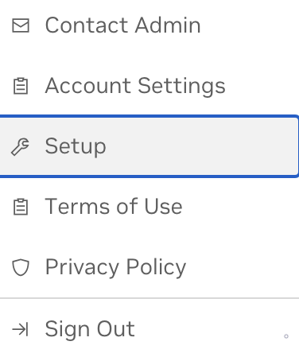

```Shell
export NGC_API_TOKEN=<your-token>
```

Create the regcred secret:
```Shell
$ kubectl create secret -n omni-streaming docker-registry regcred --docker-server=nvcr.io --docker-username='$oauthtoken' --docker-password=$NGC_API_TOKEN --dry-run=client -o json | kubectl apply -f -
```

Create the `ngc-omni-user` secret:
```Shell
$ kubectl create secret generic -n omni-streaming ngc-omni-user --from-literal=username='$oauthtoken' --from-literal=password="$NGC_API_TOKEN"
```

Add the required NVIDIA helm repositories:

```Shell
$ helm repo add omniverse https://helm.ngc.nvidia.com/nvidia/omniverse --username='$oauthtoken' --password=$NGC_API_TOKEN

$ helm repo update
```

###  3.13. <a name='OmniverseKitAppStreamingServices'></a>Omniverse Kit App Streaming Services

####  3.13.1. <a name='Streaminghelmkitappstreamingmanager'></a>*Streaming helm kit appstreaming manager*

Check `helm/kit-appstreaming-manager/values.yaml` file and update DNS names accordingly:

```yaml
ingress:
  host: api.<your-private-domain> 	   
  className: internal-nginx... 
```

To enable/disable WSS:

```yaml   
backend_csp_cls: "nv.svc.streaming._csp.Generic"    
backend_csp_args:      
  enable_wss: true    <----- set to true/false to enable/disable WSS.       
  base_domain: "<public DNS domain>" <--- (Leave blank if disabling WSS)
```

Deploy `helm/kit-appstreaming-manager` by running:
```Shell
$ helm upgrade --install --namespace omni-streaming -f helm/kit-appstreaming-manager/values.yaml streaming omniverse/kit-appstreaming-manager
```

####  3.13.2. <a name='Applicationshelmkitappstreamingapplications'></a>*Applications helm kit appstreaming applications*

Check `helm/kit-appstreaming-applications/values.yaml` file and update DNS names accordingly:

```yaml
ingress:
  host: api.<private domain name> 
```

Deploy `helm/kit-appstreaming-applications` by running:

```Shell
$ helm upgrade --install --namespace omni-streaming -f helm/kit-appstreaming-applications/values.yaml applications omniverse/kit-appstreaming-applications 
```

####  3.13.3. <a name='RMCPhelmkitappstreamingrmcp'></a>*RMCP helm kit appstreaming rmcp*

Check `helm/kit-appstreaming-rmcp/values.yaml` file and update DNS names accordingly.

Change or comment out affinity from system to agentpool

```yaml
affinity:
  nodeAffinity:
    requiredDuringSchedulingIgnoredDuringException:
      nodeSelectorTerms:
        - matchExpressions:
          - key: agentpool
            operator: In
            values:
              - agentpool   <-- this should be <name of your agentpool>
```

```Shell
$ helm upgrade --install --namespace omni-streaming -f helm/kit-appstreaming-rmcp/values.yaml rmcp omniverse/kit-appstreaming-rmcp 
```


####  3.13.4. <a name='Deploythecustomstreamingresourcesmanifestsomniverseazure'></a> *Deploy the custom streaming resources manifests omniverse azure*

To enable WSS, open `manifests/omniverse/azure/application-profile-wss.yaml` and edit the following sections listed below:

```yaml
spec:
  name: AzureLB example profile
  description: Default profile - uses an AzureLB per stream
  supportedApplications:
    - name: "contoso-application"  <--- Edit the name to reflect the Kit application's name.
    versions:
      - '*'   <--- Edit the versions to reflect which versions are intended to be supported.
```

Run `kubectl apply -n omni-streaming -f application-profile-wss.yaml`.

Make the following changes in `manifests/omniverse/azure/application-profile-azurelb.yaml`.

```yaml
metadata:
  name: <name of application profile>  <--- Edit the name to reflect the desired name of the application profile.
spec:
  name: AzureLB example profile
  description: Default profile - uses an AzureLB per stream
  supportedApplications:
    - name: "contoso-application"  <--- Edit the name to reflect the Kit application's name.
    versions:
      - '*'   <--- Edit the versions to reflect which versions are intended to be supported.

```

To disable WSS, make the following changes in `manifests/omniverse/azure/application-profile-azurelb.yaml`:

<!-- REPLACED WITH FORMATTED TEXT 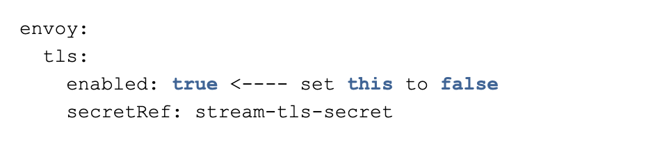 -->

```yaml
envoy:
  tls:
    enable: true <---- set this to false
    secretRef: stream-tls-secret
```

Then run: 
```Shell
$ kubectl apply -n omni-streaming -f application-profile-azurelb.yaml

$ kubectl apply -n omni-streaming -f application.yaml

$ kubectl apply -n omni-streaming -f application-version.yaml
```

####  3.13.5. <a name='DeployHelmRepositorymanifestshelmrepostiories'></a>*Deploy HelmRepository manifests helm repostiories*

Execute the following:
```Shell
$ kubectl apply -n omni-streaming -f manifests/helm-repositories/ngc-omniverse.yaml 
```
This should (eventually) show `READY: True` in the output of:

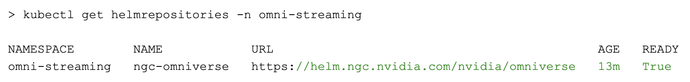

####  3.13.6. <a name='CreateprivateDNSrecordforingresscontroller'></a>*Create private DNS record for ingress controller*

Go to the Private DNS Zone you created. Create the following recordset:

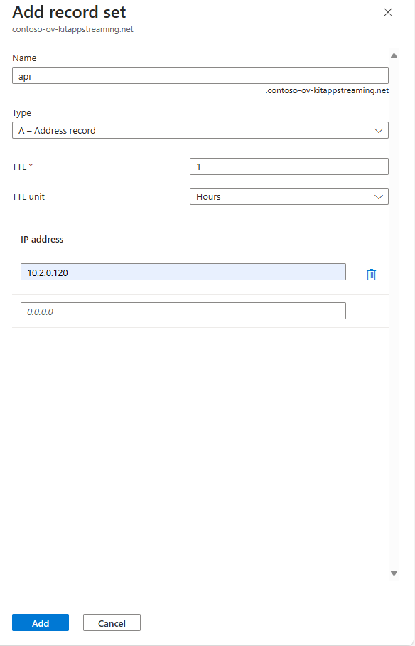

[api.contoso-ov-kitappstreaming.net](http://api.ovas-streaming.net/) -> private external ip of ingress controller LB service (e.g. 10.2.0.120 shown below)

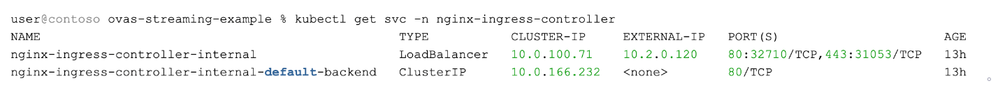

####  3.13.7. <a name='CreatepublicDNSentryforAppGateway'></a>*Create public DNS entry for App Gateway*

Navigate to the Public DNS Zone (ex. kitstreaming.iai-contoso.com) and create an A Recordset that points to the IP address of the Public IP address used in your resource group.

###  3.14. <a name='ValidateOmniverseKitAppStreamingEndPointsviaSwaggerUI'></a>Validate Omniverse Kit App Streaming End Points via Swagger UI

Before proceeding with installing web front end, let’s validate the backend services are functioning nominally using the [REST API Documentation Tool | Swagger UI.](https://swagger.io/tools/swagger-ui/)

Using the domain name URL where the Omniverse Kit App Streaming is running, append “/application/docs” or “/streaming/docs” to that URL to get respective Swagger UI web page. 
👀
For example, if public domain URL is `https://ignite.streaming.iai-contoso.com`then

* ‘appserver’ = `https://ignite.streaming.iai-contoso.com/applications/docs`

* ‘streamingServer’ = `https://ignite.streaming.iai-contoso.com/streaming/docs`

Now validate the backend running using the following steps, in the order presented.

1. `GET ${appServer}/cfg/apps`

   => Expect return list containing an entry ‘app\_id‘ \= “omni-viewer-msft"

2. `GET ${appServer}/cfg/apps/${appId}/versions`

   1. Enter “app\_id” \= omni-viewer-msft

   => Expect return of ‘appVersion’ \= “106.1.0”

3. `GET ${appServer}/cfg/apps/${appId}/versions/${appVersion}/profiles`

   1. Enter “app\_id” \= “omni-viewer-msft"

   2. Enter ‘appVersion’ \= “106.1.0”

   => Expect return of “azurelb-wss”

4. `POST ${streamServer}/streaming/stream`

   Create a stream

   => Returns a ‘session_id’ in GUID format

5. `GET ${streamServer}/streaming/stream`

   => Returns streaming sessions

6. `GET ${streamServer}/streaming/stream/${sessionId}`

   1. Enter ‘session_id' = <GUID>

   => Returns information about the stream

   (may need to poll until returns with ‘condition’ == ‘ready’)

   Note: Should have “routes” JSON filled in.

7. `DELETE ${streamServer}/streaming/stream`

   1. The session_id “id”: <GUID> needs to be supplied in the JSON request body.

8. `GET ${streamServer}/streaming/stream`

   => Verify streaming session no longer listed.

##  4. <a name='ISVWebAppdeployment'></a> ISV Web App deployment

An opinionated example web app is provided for reference as a starting point; with ISV developers expected and encouraged to further customize these examples for their own use cases. This section expands on the ISV Web App portion of the overall architecture diagram.

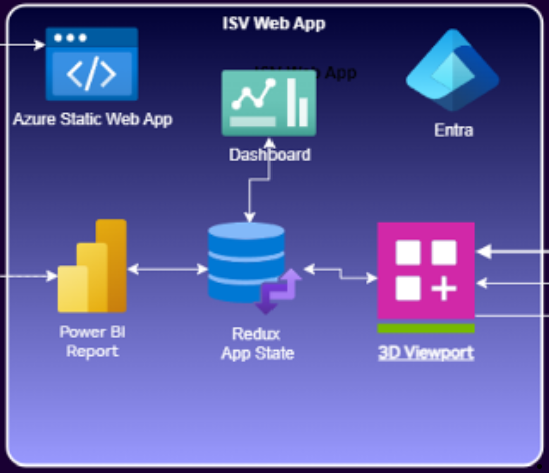

See [APPLICATION_DEVELOPMENT.md](APPLICATION_DEVELOPMENT.md) to create the web app.

###  4.1. <a name='DeployingWebClientApplicationinAzure'></a>Deploying Web Client Application in Azure

This section focuses on installing and deploying the bundled sample web client front-end.  See the Appendix for information on developing this custom ISV web client sample.  For the purposes of this sample, presume that the web client is going to be deployed as an Azure Static Web App (the ‘www’ icon in above diagram).

The ‘Dashboard’ provides the top-level index.html and React ‘App.tsx’ that presents two panels with the P*ower BI Repor*t (IoT) on left overlayed on the Omniverse powered *3D Viewport* on right, which are kept in sync by the Redux based web App State.

There is also a developer focused “test” panel available in ‘debug’ sub-folder for testing end-to-end streaming and messaging functionality between front-end and back-end for both local streaming and remote cloud streaming scenarios.  Please see Appendix for more information.

In the web-app folder there is a .env file at the root and authConfig.tsx in src folder for all business parameters to be set. 

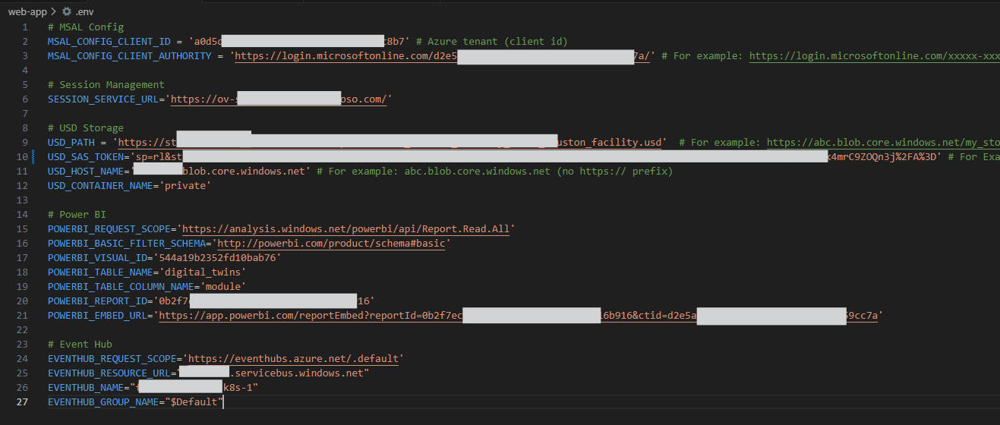


###  4.2. <a name='PowerBIReactComponentConfiguration'></a> Power BI React Component Configuration

####  4.2.1. <a name='AzureAppsRegistration'></a> *Azure Apps Registration*

Add permissions (admin consent not required) required to allow associated services access.

* API Permissions tab

  * `Power BI Service`

    * `Report.Read.All`

    * `Dataset.Read.All`

  * `Microsoft.EventHubs`

    * `user_impersonation`

  * `Azure Storage`

    * `user_impersonation`


Note: Resulting value from scope *'[https://analysis.windows.net/powerbi/api/Report.Read.All](https://analysis.windows.net/powerbi/api/Report.Read.All)'*  and *activeAccount* used to retrieve JWT token with PowerBI scope given from appregistration.

####  4.2.2. <a name='PowerBIWorkspaceSettings'></a>*Power BI Workspace Settings*

Ensure that in Power BI Workspace Settings the License Info \-\> License Configuration has been assigned for this Azure tenant.

* Current license:  **Fabric capacity**

* License Capacity:  *name* with SKU set to number of different users in region using this capacity, e.g. **name: ignitecapacityaio,** **SKU: F4, Region: West US 3**

* Semantic model storage format: **Small semantic model storage format**

####  4.2.3. <a name='PowerBIDataConnections'></a>*Power BI Data Connections*

Within Power BI workspace connects Power BI custom report to two Azure Data Explorer (ADX) datasets: *digital\_twins*, and *FluidCell*. 

The Power BI report was modified to have a transparent background so it overlays what is behind it (e.g. a 3D Viewport).

Information on embedding a custom Power BI report may be found at [Power BI embedded analytics Client APIs | Microsoft Learn](https://learn.microsoft.com/en-us/javascript/api/overview/powerbi/) . The specifics for how this was done for this example may be found in the ‘EmbedPowerBIComponent’ typescript file in this project’s GitHub Repo.   Microsoft copilot may also clarify and generate appropriate code.

In the .env  file parameter values need to be examined closely.

* *POWERBI_EMBED_URL*

  * This is actual embedded URL copied from the Power BI app “File | Embed” menu item embed content link from the “Securely embed this report in a website or portal” dialog.

  * Remove “\&autoAuth=True” from the embed URL before pasting; otherwise, will receive an error.

* Copy the value portion of the “?reportId=value” of the *POWERBI_EMBED_URL* and paste it into the *POWERBI_REPORT_ID.*

* The *POWERBI_TABLE_NAME* value should be “digital_twins” to match the ADX Data Source name.

* The *POWERBI_TABLE_COLUMN_NAME* value should be “module”, which needs to match the Power BI Slicer (filter) column name “module” in the “digital\_twins” ADX Data table for this report.

* The *POWERBI_VISUAL_ID* is more complicated to obtain because it needs to be retrieved at runtime from the “module” Power BI Slicer in the Power BI Report.  One way to accomplish this is to add an ‘console.log(visual.name)’ statement in the eventHandlers when visual.type is ‘slicer’, then paste the returned value, which looks more like an id, are the value for this argument. This will be examined more closely below.

Note; The organization and description of these tables may be found in the associated Azure Data Explorer (ADX) time-series database Query page in the Azure Portal.

To get the *POWERBI_VISUAL_ID*  of the Power BI for BI-Directional interaction from the 3D Viewport <> Power BI the Visual Slicer ID is needed to be filled out in the *.env* file with the parameter named *POWERBI_VISUAL_ID*. To get the *POWERBI_VISUAL_ID* of the Power BI Slicer see console.log noted here:

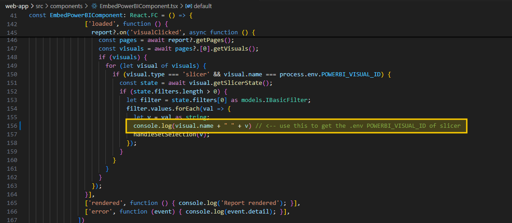


In the .env file set parameters *POWERBI_TABLE_NAME* and *POWERBI_COLUMN_NAME* to equal the table name and column name in the dataset inside the Power BI. 

The values of the *POWERBI_COLUMN_NAME* matching the *asset_id* parameters set in the USD will allow for BI-Directional selection.

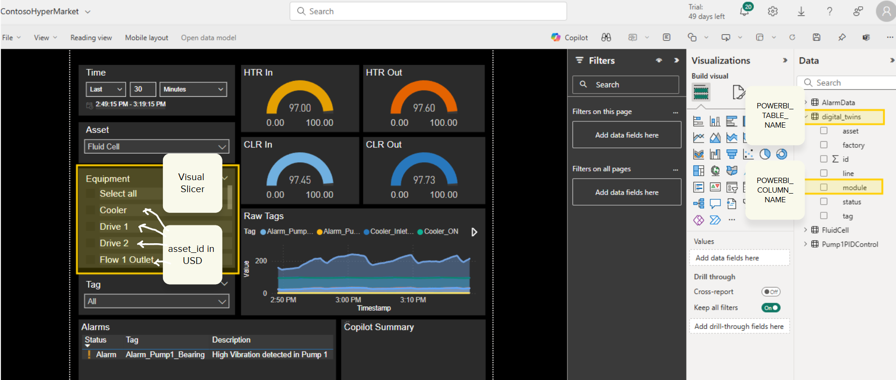

Once everything is setup correctly meshes or group of meshes with *asset_id* parameter assigned to them in USD matching the table.column in Power BI slicer the Bi-Directional selecting will appear as this:

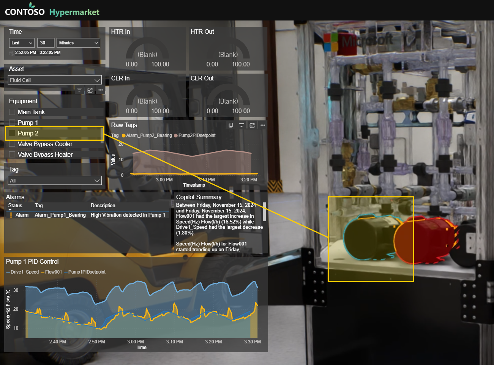

####  4.2.4. <a name='EventHubs'></a>*Event Hubs*

Add role assignments to the Event Hubs Namespace and Event Hub itself via Access Control (IAM):

* Azure Event Hubs Data Receiver

* Azure Events Hub Data Sender


###  4.3. <a name='EventHubReactComponentConfiguration'></a>Event Hub React Component Configuration

At the top of the screen selected Event Hub stream values received from the Azure IoT Operations are being updated.  This is configured via the *.env* paramaters values:

*  `EVENTHUB_RESOURCE_URL`

*  `EVENTHUB_NAME`

*  `EVENTHUB_GROUP_NAME`

For this to work, a new token needs to be retrieved with the proper scope, which is specified in more detail in *EventHubStreamCompoment* typescript file in this project’s rep, which subcribe to *processInitialize()*, *processClose()*, and *processEvents()* methods via a WebSocket connection.

Note: The *processEvents()* callback performs a check on the current pressure and updates the Redux based global state.

To use the event data inside the 3D viewport the global state must be updated. We provide a simple example in code in the file *EventHubStreamComponent*. The data payload will be JSON and can be parsed and sent as needed shown here:

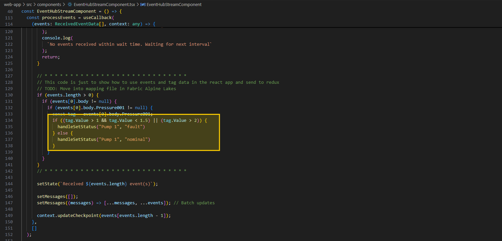

For a more general tutorial on how to does this, please see [Send or receive events using JavaScript \- Azure Event Hubs | Microsoft Learn](https://learn.microsoft.com/en-us/azure/event-hubs/event-hubs-node-get-started-send?tabs=passwordless%2Croles-azure-portal)


###  4.4. <a name='DViewportReactComponentConfiguration'></a>3D Viewport React Component Configuration

The 3D Viewport React Component is configured via changing the web app’s global state variables.  Hence, update the initial state of the Redux global state to reflect those initial values.   The initial state values in the web-app/src/state/slice/serviceSlice.ts file should match the ones set in the ISV Custom Kit App Configuration section above.

    appId: 'usd-viewer-msft',  
    version: '106.1.0',  
    profile: 'azurelb-wss',

###  4.5. <a name='AzureStaticWebApplicationDeployment'></a>Azure Static Web Application Deployment

The web-app sub-folder in the GitHub repo includes everything in ISV Web App, including Power BI component, Redux component, and 3D Viewport Component.  The Power BI React Component provides the integration between Power BI Reports and the Redux based global state manager via Redux Slices and Reducers.  The 3D Viewport Component encapsulates the Omniverse Streaming functionality and likewise provides the integration with the Redux global state manager via Slices and Reducers. 

See [APPLICATION_DEVELOPMENT.md](APPLICATION_DEVELOPMENT.md) to create the web-app.

####  4.5.1. <a name='DeployingaReactApptoAzureStaticWebAppsusingAzurePortal'></a> *Deploying a React App to Azure Static Web Apps using Azure Portal*

##### Create a New Azure Static Web App

1. Log in to the Azure Portal at [https://portal.azure.com/](https://portal.azure.com/).  
2. Click on **Create a resource** and search for **Static Web Apps**.  
3. Click on **Static Web Apps** and then click on **Create**.  
4. Fill in the required details:  
   1. **Subscription**: Select your Azure subscription.  
   2. **Resource group**: Create a new resource group or select an existing one.  
   3. **Name**: Enter a name for your Static Web App.  
   4. **Account plan**: Select a plan that suits your needs.  
5. Click on **Review \+ create** and then **Create**.

##### Configure the Static Web App 

1. Once the deployment is complete, navigate to your newly created Static Web App.  
2. Click on **Configuration** under the **Settings** section.  
3. Configure the following settings:  
   1. **Default document**: Set to index.html.  
   2. **Default directory**: Set to the root directory of your React app (usually public or build).  
   3. **Route rules**: Configure any route rules as needed for your app.

##### Deploy Your React App

1. Click on **Deployment** under the **Settings** section.  
2. Click on **Connect to GitHub** (or your preferred repository provider).  
3. Follow the prompts to connect your repository to Azure.  
4. Select the repository and branch that contains your React app.  
5. Azure will automatically detect the build configuration and deploy your app.

##### Verify the Deployment 

1. Once the deployment is complete, navigate to the **Overview** section of your Static Web App.  
2. Click on the **Site URL** to verify that your React app is deployed and accessible.

##  5. <a name='FinalEnd-to-EndValidation'></a>Final End-to-End Validation

###  5.1. <a name='3DViewerComponent'></a> 3D Viewer Component

This step validates that pod containing and Envoy proxy is running in Kubernetes can be accessed remotely via Azure cloud using Omniverse Kit App Streaming with WebRTC streaming Omniverse Viewport to the bundled React app running in an Edge or Chrome browser. See GitHub Repo “testing” panel.

Web client users should be able to navigate around in the 3D Viewport panel using mouse controls or WSAD movement.  [Viewport Navigation — Omniverse Extensions latest documentation](https://docs.omniverse.nvidia.com/extensions/latest/ext_core/ext_viewport/navigation.html)    When an object in the 3D Viewport scene is “picked” (left mouse click), that information is sent to the Power BI Report.   Note that only pre-specified objects in the scene are pickable. 

###  5.2. <a name='PowerBIComponent'></a>Power BI Component

*Signing in should present Power BI report, with IoT data streaming into report tables.*

###  5.3. <a name='ValidationofCompleteISVWebAppDeployment'></a>Validation of Complete ISV Web App Deployment

*How to validate the two panels together in top-level web app. TBD*